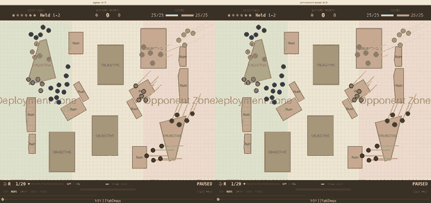

# Wargame RL

Reinforcement learning model for playing table top wargames.

## Where we are

*Written for someone who knows the game but not the machine learning.*

The scenario: **25 models a side in five units of five**, both players carrying
the identical profile, over five or six objectives on real table layouts. **All
combat is shooting, to a maximum of 12 inches.** Every player — hand-written or
trained — is scored on **nine tables it has never seen**, reported as the average
victory-point margin, ours minus theirs.

**The opponent is now `squad_march_take`, the strongest hand-written player**,
and that change is why the numbers below look small. Against the weak opponent
this project used until recently, the best hand-written play scored **+104.9**;
against this one it scores **−5.6**. The game got about 110 points harder, so
**nothing here is comparable to a figure quoted before 2026-08-16.**



*One game on a held-out table, same weights and same dice on both sides — only
the decision-making differs. Left, each model picks its own move: the force is
strung out, ten models already lost, holding two objectives. Right, the squad
picks its moves together (below): tight formation, 22 of 25 alive, three
objectives. Round 7 of 20.*

### What it scores

Nine held-out tables, three independently trained models, against four different
opponents. The scripts are re-measured against each opponent, because changing
the opponent changes the game:

| opponent it faces | trained model | best hand-written player | |
|---|---|---|---|
| `squad_march_take` — the strongest | **+2.6** | −4.4 | **ahead** |
| `squad_march_shoot` | **+19.3** | +12.1 | **ahead** |
| `squad_march_deny` | **+4.0** | −3.1 | **ahead** |
| `contest_and_spread` | +17.4 | **+31.1** | behind by 13.7 |

**Ahead of the best hand-written play in three matchups of four.**

⚠ Read those numbers *down a column*, never across. A player's absolute score
mostly measures how weak its opponent is — the trained model scores *higher*
against the weaker opponents while doing relatively *worse*.

### It follows the rules, which it previously did not

Under the 2"/9" coherency rule it keeps a unit together on **0.94–0.97** of
unit-moves, against **0.80–0.89** for the hand-written players. Nothing measured
in this project had previously held above 0.94.

That was the hard part. A squad is five models each choosing a move on its own,
but the rule is about the five moves *together* — so five individually sensible
choices can tear a squad apart, and under the rules the whole squad's move is
then cancelled. **One squad move in three was being thrown away**, and half of
all the movement the army wanted to make never happened.

The fix is not a better-trained model. It is a better *decision*: each model
names its top three moves, the squad considers all 243 combinations of those,
and it plays the best combination that keeps the unit together — checking where
the models will *actually* end up, collisions and all, rather than where they
aimed. Only about 5% of individual moves change, but because the old rule was
all-or-nothing, changing one model's move rescues a whole squad.

⚠ **Most of the current strength is that decision, not the training.** The same
trained weights, with each model left to choose alone, score about **−29**.

### What it still cannot do

It has **one mode**. It plays a defensive game better than any hand-written
player — it concedes far fewer points than they do, and it never loses an
objective it has committed to. What it cannot do is switch to the aggressive game
when ground is cheap, and that is the entire reason it loses to
`contest_and_spread`, the opponent that spreads itself thin and leaves objectives
lightly held.

That gap is about **0.36 of an objective**, and it is a question of arriving
*earlier on the right objectives* rather than sending more models. Sending more
models has been measured and it loses.

Full detail: [reports/](reports/README.md), most recently
[the chain tail and the frozen army](reports/2026-08-18-the-chain-tail-and-the-frozen-army.md).

## Documentation

- [Goals & Roadmap](docs/goals-and-roadmap.md) — Project vision, current status, and phased development plan
- [Rules Reference](docs/rules/README.md) — The full rules specification for the game we're modelling, plus a per-rule map of what the environment implements
- [Movement System](docs/movement.md) — How polar coordinate movement works (action encoding, direction, speed, configuration)
- [DDD in wargame/envs](docs/ddd-envs.md) — Domain-driven design motivation and how to extend the environment
- [Metrics Reference](docs/metrics.md) — Semantics of every Wandb metric, plus an evaluation procedure for assessing runs

## How to add a feature to the environement?
1. Update types, states and space
2. Update the state_to_tensor
3. Update the reward
4. Be sure that pytest is working

# Development

## 🎯 Core Features

### Development Tools

- 📦 UV - Ultra-fast Python package manager
- 🚀 Just - Modern command runner with powerful features
- 💅 Ruff - Lightning-fast linter and formatter
- 🔍 Mypy - Static type checker
- 🧪 Pytest - Testing framework with fixtures and plugins
- 🧾 Loguru - Python logging made simple

### Infrastructure

- 🛫 Pre-commit hooks
- 🐳 Docker support with multi-stage builds and slim images
- 🔄 GitHub Actions CI/CD pipeline


## Usage

The template is based on [UV](https://docs.astral.sh/) as package manager and [Just](https://github.com/casey/just) as command runner. You need to have both installed in your system to use this template.

To get started, install `just`, you can run `brew install just`, then just run
```bash
just setup
```

Here are other useful `just` command setup for this repository...
```bash
just dev-sync
```

to create a virtual environment and install all the dependencies, including the development ones. If instead you want to build a "production-like" environment, you can run

```bash
just prod-sync
```

In both cases, all extra dependencies will be installed (notice that the current pyproject.toml file has no extra dependencies).

You also need to install the pre-commit hooks with:

```bash
just install-hooks
```

### Formatting, Linting and Testing

You can configure Ruff by editing the `ruff.toml` file (line length 88, double quotes).

Format your code:

```bash
just format
```

Run linters (ruff and mypy):

```bash
just lint
```

Run tests:

```bash
just test
```

Do all of the above:

```bash
just validate
```

### Executing

#### Training

PPO on a transformer policy is the only configuration:
```bash
just train configs/golden/25v25_shooting_opponent.yaml
```

Cap the run at a number of epochs:
```bash
just train configs/golden/25v25_shooting_opponent.yaml 800
```

Resume full training state (model + optimizer + epoch/step) from an existing checkpoint:
```bash
uv run train.py --env-config-path configs/dev/ci_smoke.yaml --resume-ckpt-path checkpoints/<run>/last.ckpt
```

Warm start from checkpoint weights only (fresh optimizer and training counters):
```bash
uv run train.py --env-config-path configs/dev/ci_smoke.yaml --warm-start-ckpt-path checkpoints/<run>/last.ckpt
```

#### Running a simulation

Latest checkpoint, will find the last checkpoint file and its related env config:
```bash
just simulate-latest
```


Specific checkpoint:
```bash
just simulate checkpoints/ppo-transformer-25v25-2026-08-09-10-30-00/last.ckpt checkpoints/ppo-transformer-25v25-2026-08-09-10-30-00/env_config.yaml
```

#### Testing Env

You can run the environment in isolation while random actions are fed to the agent.

```bash
just test-env
```

### Docker

The template includes a multi stage Dockerfile, which produces an image with the code and the dependencies installed. You can build the image with:

```bash
just dockerize
```

### Github Actions

There is one Github Actions workflow: it runs formatting, linting and tests on every push to `main` and on every pull request. You can find the workflow file in `.github/workflows/main-validate.yaml`.
