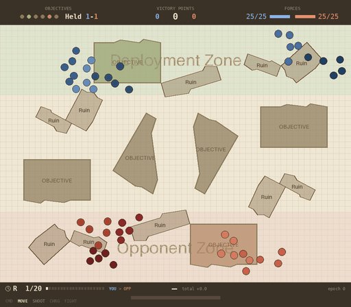
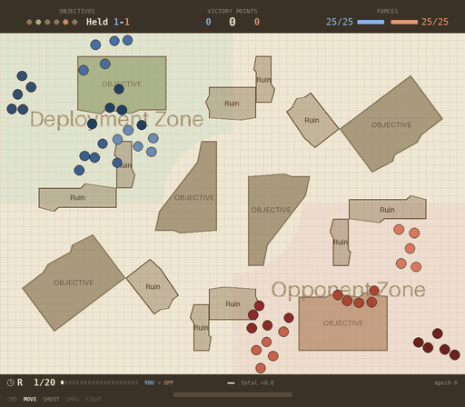
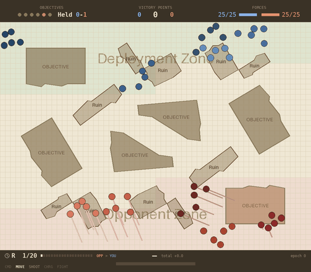
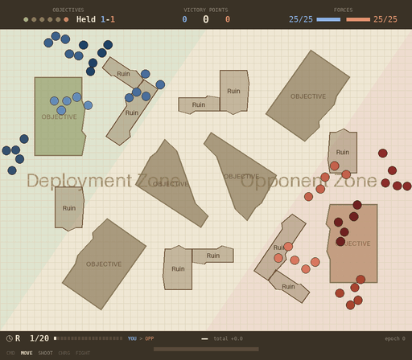

# Wargame RL

Reinforcement learning model for playing table top wargames.

## Where we are

*Written for someone who knows the game but not the machine learning.*

The scenario: **25 models a side in five units of five**, both players carrying
the identical profile, over five or six objectives on real table layouts. **All
combat is shooting, to a maximum of 12 inches.** Every player — hand-written or
trained — is scored on **nine tables it has never seen**, reported as the average
victory-point margin, ours minus theirs.

**The opponent is now `squad_march_take`, the strongest hand-written player**,
and that change is why the numbers below look small. Measured with that same
player on both sides of the change, over all 45 tables: it scores **+126.2**
against the weak opponent this project used until recently, and **+5.9** against
the current one. The game got about 120 points harder, so **nothing here is
comparable to a figure quoted before 2026-08-16.**

Everything below was re-measured on 2026-08-21, on evaluation tables that are
now **generated from the published layout data** rather than traced by hand —
new terrain, objectives resolved as ruins, and each table's own deployment zones.
Two earlier bug fixes also moved the game: a **dead** model used to keep yours
from shooting (2026-08-19), and models stopped blocking line of sight
(2026-08-13). Figures quoted before those dates are not comparable either.

### What a game looks like

Four of the nine held-out tables, one game each, played by the trained model
against `squad_march_take`. The tables carry **six different deployment shapes**
and only one of them is the rectangle a scenario config can describe — the
tinted bands below are the layouts' own zones.

| | |
|---|---|
|  |  |
| **table 45 — long edges.** Armies 20 inches apart across the *short* axis, at a 12-inch weapon range: a different game from turn one. Ends **120–60**. | **table 30 — opposed quadrants.** The zone boundary is an arc, 61 vertices. Ends **235–175**, 12 models left. |
|  |  |
| **table 35 — stepped bands.** A **loss**, 150–205, down to 6 models. | **table 15 — diagonal halves.** The zone is a triangle cut by the board diagonal. Ends **105–70**. |

*Each is the **median of eleven** games on that table — a rule chosen so the
picture is not the model's best game, which is how the previous illustration
here was picked. Read them as one game each, not as a score: over thirty games
this model averages +21, +46, **+12** and +56 on these four tables respectively.
Table 35 is the honest one — its median game is a loss even though its average is
positive, so a single game there is a poor guide either way.*

### The opponents

All four are hand-written. They form a ladder — each adds exactly one behaviour
to the one above it — except the last, which plays a different way entirely:

| opponent | what it does |
|---|---|
| `squad_march_shoot` | Each squad marches to one objective as a body and holds it, firing at the nearest target in range. |
| `squad_march_deny` | The same, but squads with nothing left to hold go and **contest what the other side holds**. |
| `squad_march_take` | The same, but those spare squads instead go for the **most weakly held** objective — the cheapest to flip. Strongest of the four. |
| `contest_and_spread` | Allocates squads against **where the enemy has actually deployed** rather than by a fixed rule, and spreads its fire instead of always shooting the nearest. |

### What it scores

Nine held-out tables, three independently trained models, 20 rounds a game.
Trained by `just train-coherency-baseline` on
`configs/golden/25v25_maps_two_mode.yaml` and played with the top-3 joint decode
— **both matter**, and a figure quoted without them is not comparable. (The
figures published here before 2026-08-20 came from a different training config
and understated the model by about 16 points.)
Figures are the **average victory-point margin — ours minus theirs**, so 0 is a
dead heat and +20 means winning by twenty points a game.

Re-measured **2026-08-21** on the generated evaluation tables, with the
hand-written players re-measured against **each** opponent — swapping the
opponent changes the game, and voids every baseline on that config:

| opponent it faces | trained model<br>*avg VP margin* | best hand-written player<br>*avg VP margin* | |
|---|---|---|---|
| `squad_march_take` — the strongest | **+22.6** | −1.1 | **ahead by 23.7** |
| `squad_march_shoot` | **+40.2** | +23.0 | ahead by 17.2 |
| `squad_march_deny` | **+24.4** | −8.9 | **ahead by 33.4** |
| `contest_and_spread` | +21.8 | **+30.2** | **behind by 8.4** |

**Ahead of the best hand-written play in three matchups of four, and behind in
the fourth.**

Two of the three leads are decisive — paired per table, t = 3.1 and 4.0, the
same sign on 8 of 9 tables. The lead against `squad_march_shoot` is **not
settled** (t = 1.8, 7 of 9). Nor is the loss against `contest_and_spread`
(t = −1.1, 3 of 9), but it is the one matchup where the model does not lead, and
the seed spread is wide there: +30.9, +8.1, +26.4 against a bar of +30.2.

That opponent spreads thin, and taking cheap ground has always been this model's
weakest habit — it wins by conceding little rather than by taking much, which is
worth less against an opponent that holds nothing firmly.

⚠ **An earlier version of this table showed `contest_and_spread` as a 9.4-point
lead, and it was measured on the hand-traced tables.** On the generated ones the
matchup reverses. Do not treat the loss as retired.

It also keeps its squads together better than any hand-written player in every
matchup — unit coherency **0.950–0.954**, against a scripted band of
**0.903–0.908**. That is the game's own formation rule, and it is measured on
what the model *intended*, not on what a referee corrected. Formation is the one
thing that holds in **all four** matchups, including the one it loses.

⚠ Read those numbers *down a column*, never across. A player's absolute score
mostly measures how weak its opponent is — the trained model scores *higher*
against the weaker opponents while doing relatively *worse*. The only meaningful
comparison is the two figures on the same row, which faced the same opponent.

Full detail: [reports/](reports/README.md), most recently
[the chain tail and the frozen army](reports/2026-08-18-the-chain-tail-and-the-frozen-army.md).

## Documentation

- [Goals & Roadmap](docs/goals-and-roadmap.md) — Project vision, current status, and phased development plan
- [Rules Reference](docs/rules/README.md) — The full rules specification for the game we're modelling, plus a per-rule map of what the environment implements
- [Movement System](docs/movement.md) — How polar coordinate movement works (action encoding, direction, speed, configuration)
- [DDD in wargame/envs](docs/ddd-envs.md) — Domain-driven design motivation and how to extend the environment
- [Metrics Reference](docs/metrics.md) — Semantics of every Wandb metric, plus an evaluation procedure for assessing runs

## How to add a feature to the environement?
1. Update types, states and space
2. Update the state_to_tensor
3. Update the reward
4. Be sure that pytest is working

# Development

## 🎯 Core Features

### Development Tools

- 📦 UV - Ultra-fast Python package manager
- 🚀 Just - Modern command runner with powerful features
- 💅 Ruff - Lightning-fast linter and formatter
- 🔍 Mypy - Static type checker
- 🧪 Pytest - Testing framework with fixtures and plugins
- 🧾 Loguru - Python logging made simple

### Infrastructure

- 🛫 Pre-commit hooks
- 🐳 Docker support with multi-stage builds and slim images
- 🔄 GitHub Actions CI/CD pipeline


## Usage

The template is based on [UV](https://docs.astral.sh/) as package manager and [Just](https://github.com/casey/just) as command runner. You need to have both installed in your system to use this template.

To get started, install `just`, you can run `brew install just`, then just run
```bash
just setup
```

Here are other useful `just` command setup for this repository...
```bash
just dev-sync
```

to create a virtual environment and install all the dependencies, including the development ones. If instead you want to build a "production-like" environment, you can run

```bash
just prod-sync
```

In both cases, all extra dependencies will be installed (notice that the current pyproject.toml file has no extra dependencies).

You also need to install the pre-commit hooks with:

```bash
just install-hooks
```

### Formatting, Linting and Testing

You can configure Ruff by editing the `ruff.toml` file (line length 88, double quotes).

Format your code:

```bash
just format
```

Run linters (ruff and mypy):

```bash
just lint
```

Run tests:

```bash
just test
```

Do all of the above:

```bash
just validate
```

### Executing

#### Training

PPO on a transformer policy is the only configuration:
```bash
just train configs/golden/25v25_shooting_opponent.yaml
```

Cap the run at a number of epochs:
```bash
just train configs/golden/25v25_shooting_opponent.yaml 800
```

Resume full training state (model + optimizer + epoch/step) from an existing checkpoint:
```bash
uv run train.py --env-config-path configs/dev/ci_smoke.yaml --resume-ckpt-path checkpoints/<run>/last.ckpt
```

Warm start from checkpoint weights only (fresh optimizer and training counters):
```bash
uv run train.py --env-config-path configs/dev/ci_smoke.yaml --warm-start-ckpt-path checkpoints/<run>/last.ckpt
```

#### Running a simulation

Latest checkpoint, will find the last checkpoint file and its related env config:
```bash
just simulate-latest
```


Specific checkpoint:
```bash
just simulate checkpoints/ppo-transformer-25v25-2026-08-09-10-30-00/last.ckpt checkpoints/ppo-transformer-25v25-2026-08-09-10-30-00/env_config.yaml
```

#### Testing Env

You can run the environment in isolation while random actions are fed to the agent.

```bash
just test-env
```

### Docker

The template includes a multi stage Dockerfile, which produces an image with the code and the dependencies installed. You can build the image with:

```bash
just dockerize
```

### Github Actions

There is one Github Actions workflow: it runs formatting, linting and tests on every push to `main` and on every pull request. You can find the workflow file in `.github/workflows/main-validate.yaml`.
