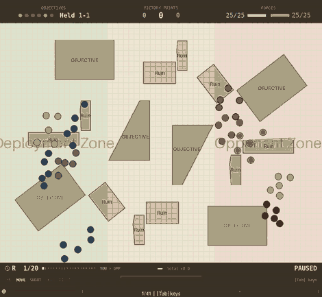

# Wargame RL

Reinforcement learning model for playing table top wargames.

## Where we are

*Written for someone who knows the game but not the machine learning.*

The scenario: **25 models a side in five units of five**, both players carrying
the identical profile, over five or six objectives on real table layouts. **All
combat is shooting, to a maximum of 12 inches.** Every player — hand-written or
trained — is scored on **nine tables it has never seen**, reported as the average
victory-point margin, ours minus theirs.

**The opponent is now `squad_march_take`, the strongest hand-written player**,
and that change is why the numbers below look small. Against the weak opponent
this project used until recently, the best hand-written play scores **+105.7**;
against this one it scores **−6.2**. The game got about 110 points harder, so
**nothing here is comparable to a figure quoted before 2026-08-16.**

Everything below was re-measured on 2026-08-19 after a bug fix that changed the
game: a **dead** model used to keep yours from shooting, which fired on 8.7% of
model-steps. Figures quoted before that date are not comparable either.



*One game on table 30, one of the nine it has never seen. It ends **210–125**,
holding two objectives to one, with **12 models left against 2** — and its squads
stay together throughout (unit coherency **0.962** here, against 0.94–0.97 for
this model in general). Selected from a sweep of ten games on this table, on
**both** counts — a decisive win and clean formation. The table below is the
average; this is the model at its best.*

### The opponents

All four are hand-written. They form a ladder — each adds exactly one behaviour
to the one above it — except the last, which plays a different way entirely:

| opponent | what it does |
|---|---|
| `squad_march_shoot` | Each squad marches to one objective as a body and holds it, firing at the nearest target in range. |
| `squad_march_deny` | The same, but squads with nothing left to hold go and **contest what the other side holds**. |
| `squad_march_take` | The same, but those spare squads instead go for the **most weakly held** objective — the cheapest to flip. Strongest of the four. |
| `contest_and_spread` | Allocates squads against **where the enemy has actually deployed** rather than by a fixed rule, and spreads its fire instead of always shooting the nearest. |

### What it scores

Nine held-out tables, three independently trained models, 20 rounds a game.
Figures are the **average victory-point margin — ours minus theirs**, so 0 is a
dead heat and +20 means winning by twenty points a game.

The hand-written players are re-measured against **each** opponent, because
changing the opponent changes the game:

| opponent it faces | trained model<br>*avg VP margin* | best hand-written player<br>*avg VP margin* | |
|---|---|---|---|
| `squad_march_take` — the strongest | **+8.0** | −6.2 | **ahead by 14.2** |
| `squad_march_shoot` | **+25.0** | +13.4 | **ahead by 11.6** |
| `squad_march_deny` | **+10.0** | −7.0 | **ahead by 17.0** |
| `contest_and_spread` | +21.8 | **+25.9** | behind by 4.1 |

**Ahead of the best hand-written play in three matchups of four.**

It also keeps its squads together better than any hand-written player in every
matchup — unit coherency **0.934–0.942**, against a scripted band of
**0.777–0.895**. That is the game's own formation rule, and it is measured on
what the model *intended*, not on what a referee corrected.

⚠ Read those numbers *down a column*, never across. A player's absolute score
mostly measures how weak its opponent is — the trained model scores *higher*
against the weaker opponents while doing relatively *worse*. The only meaningful
comparison is the two figures on the same row, which faced the same opponent.

Full detail: [reports/](reports/README.md), most recently
[the chain tail and the frozen army](reports/2026-08-18-the-chain-tail-and-the-frozen-army.md).

## Documentation

- [Goals & Roadmap](docs/goals-and-roadmap.md) — Project vision, current status, and phased development plan
- [Rules Reference](docs/rules/README.md) — The full rules specification for the game we're modelling, plus a per-rule map of what the environment implements
- [Movement System](docs/movement.md) — How polar coordinate movement works (action encoding, direction, speed, configuration)
- [DDD in wargame/envs](docs/ddd-envs.md) — Domain-driven design motivation and how to extend the environment
- [Metrics Reference](docs/metrics.md) — Semantics of every Wandb metric, plus an evaluation procedure for assessing runs

## How to add a feature to the environement?
1. Update types, states and space
2. Update the state_to_tensor
3. Update the reward
4. Be sure that pytest is working

# Development

## 🎯 Core Features

### Development Tools

- 📦 UV - Ultra-fast Python package manager
- 🚀 Just - Modern command runner with powerful features
- 💅 Ruff - Lightning-fast linter and formatter
- 🔍 Mypy - Static type checker
- 🧪 Pytest - Testing framework with fixtures and plugins
- 🧾 Loguru - Python logging made simple

### Infrastructure

- 🛫 Pre-commit hooks
- 🐳 Docker support with multi-stage builds and slim images
- 🔄 GitHub Actions CI/CD pipeline


## Usage

The template is based on [UV](https://docs.astral.sh/) as package manager and [Just](https://github.com/casey/just) as command runner. You need to have both installed in your system to use this template.

To get started, install `just`, you can run `brew install just`, then just run
```bash
just setup
```

Here are other useful `just` command setup for this repository...
```bash
just dev-sync
```

to create a virtual environment and install all the dependencies, including the development ones. If instead you want to build a "production-like" environment, you can run

```bash
just prod-sync
```

In both cases, all extra dependencies will be installed (notice that the current pyproject.toml file has no extra dependencies).

You also need to install the pre-commit hooks with:

```bash
just install-hooks
```

### Formatting, Linting and Testing

You can configure Ruff by editing the `ruff.toml` file (line length 88, double quotes).

Format your code:

```bash
just format
```

Run linters (ruff and mypy):

```bash
just lint
```

Run tests:

```bash
just test
```

Do all of the above:

```bash
just validate
```

### Executing

#### Training

PPO on a transformer policy is the only configuration:
```bash
just train configs/golden/25v25_shooting_opponent.yaml
```

Cap the run at a number of epochs:
```bash
just train configs/golden/25v25_shooting_opponent.yaml 800
```

Resume full training state (model + optimizer + epoch/step) from an existing checkpoint:
```bash
uv run train.py --env-config-path configs/dev/ci_smoke.yaml --resume-ckpt-path checkpoints/<run>/last.ckpt
```

Warm start from checkpoint weights only (fresh optimizer and training counters):
```bash
uv run train.py --env-config-path configs/dev/ci_smoke.yaml --warm-start-ckpt-path checkpoints/<run>/last.ckpt
```

#### Running a simulation

Latest checkpoint, will find the last checkpoint file and its related env config:
```bash
just simulate-latest
```


Specific checkpoint:
```bash
just simulate checkpoints/ppo-transformer-25v25-2026-08-09-10-30-00/last.ckpt checkpoints/ppo-transformer-25v25-2026-08-09-10-30-00/env_config.yaml
```

#### Testing Env

You can run the environment in isolation while random actions are fed to the agent.

```bash
just test-env
```

### Docker

The template includes a multi stage Dockerfile, which produces an image with the code and the dependencies installed. You can build the image with:

```bash
just dockerize
```

### Github Actions

There is one Github Actions workflow: it runs formatting, linting and tests on every push to `main` and on every pull request. You can find the workflow file in `.github/workflows/main-validate.yaml`.
