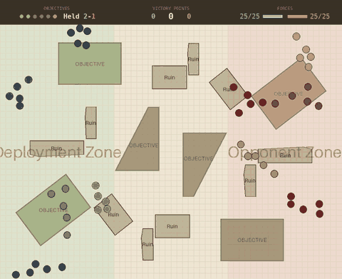

# Wargame RL

Reinforcement learning model for playing table top wargames.

## Where we are

*Written for someone who knows the game but not the machine learning.*

Every player — hand-written or trained — is scored the same way: **100 games of
20 rounds on each of nine tables it has never seen** — 900 games in all —
reported as the average victory-point margin, ours minus theirs. A 25-model
force a side, five or six objectives.



*One selected game — blue, moving first — on table 30, one of the nine it has
never seen. It ends **285–120**, holding four objectives to one, with the
player's score at the maximum a side can bank in twenty rounds. Chosen from a
sweep of 54 games on **both** counts — a decisive win and units that stayed
legal (coherency 0.960 here, against ~0.71 for this model in general). The
table below is the average over 900 games; this is the model at its best on
both, not a typical outing.*

| player | VP margin | objectives held | force surviving | VP conceded |
|---|---|---|---|---|
| deploys and never moves | −88.9 | 1.27 | 100% | 210.0 |
| moves at random | −26.4 | 1.96 | 82% | 208.6 |
| walks squads onto objectives | +79.4 | 3.50 | 67% | 190.9 |
| …and shoots | +111.8 | 4.00 | 76% | 160.4 |
| **`squad_march_take` — …and takes the weakest-held ground first; strongest player** | **+116.7** | 4.02 | 76% | 160.8 |
| **trained model, taught by copying** | **+113.6** | 3.82 | 67% | 158.0 |
| **trained model, learning on its own** | **+75.9 to +84.7** | 3.24 | 95% | 181.6 |

### What the trained model can do

It plays a competent, cautious holding game. It deploys, moves onto objectives
and keeps them, and it **maxes out its own scoring** — 264 points of
a 285 ceiling, which is within a few points of the best player on the table. On
its own half of the scoreboard it is close to perfect.

It has learned the shape of the mission: it holds around three objectives
consistently, which is exactly the number that saturates the 15-point-a-round
scoring cap. It does not wander, it does not stall, and it does not lose games
it should win.

**Where it is weakest is unit coherency.** Under the 2"/9" rule it keeps a unit
together on **0.665** of unit-moves, against **0.884** for the hand-written
policy it learned from and **0.853** for the earlier model that learned on its
own — and its squads tend to come apart into separate groups rather than merely
stretch. Nothing in the score reflects this: coherency is measured but not
enforced in this scenario, so a model can play a winning game while its units
fragment. Six copies were measured and all six sit below both, so it is a
property of the copying, not a bad run.

Full detail: [reports/](reports/README.md), most recently
[the cap makes it a denial game](reports/2026-08-16-the-cap-makes-it-a-denial-game.md).

## Documentation

- [Goals & Roadmap](docs/goals-and-roadmap.md) — Project vision, current status, and phased development plan
- [Rules Reference](docs/rules/README.md) — The full rules specification for the game we're modelling, plus a per-rule map of what the environment implements
- [Movement System](docs/movement.md) — How polar coordinate movement works (action encoding, direction, speed, configuration)
- [DDD in wargame/envs](docs/ddd-envs.md) — Domain-driven design motivation and how to extend the environment
- [Metrics Reference](docs/metrics.md) — Semantics of every Wandb metric, plus an evaluation procedure for assessing runs

## How to add a feature to the environement?
1. Update types, states and space
2. Update the state_to_tensor
3. Update the reward
4. Be sure that pytest is working

# Development

## 🎯 Core Features

### Development Tools

- 📦 UV - Ultra-fast Python package manager
- 🚀 Just - Modern command runner with powerful features
- 💅 Ruff - Lightning-fast linter and formatter
- 🔍 Mypy - Static type checker
- 🧪 Pytest - Testing framework with fixtures and plugins
- 🧾 Loguru - Python logging made simple

### Infrastructure

- 🛫 Pre-commit hooks
- 🐳 Docker support with multi-stage builds and slim images
- 🔄 GitHub Actions CI/CD pipeline


## Usage

The template is based on [UV](https://docs.astral.sh/) as package manager and [Just](https://github.com/casey/just) as command runner. You need to have both installed in your system to use this template.

To get started, install `just`, you can run `brew install just`, then just run
```bash
just setup
```

Here are other useful `just` command setup for this repository...
```bash
just dev-sync
```

to create a virtual environment and install all the dependencies, including the development ones. If instead you want to build a "production-like" environment, you can run

```bash
just prod-sync
```

In both cases, all extra dependencies will be installed (notice that the current pyproject.toml file has no extra dependencies).

You also need to install the pre-commit hooks with:

```bash
just install-hooks
```

### Formatting, Linting and Testing

You can configure Ruff by editing the `ruff.toml` file (line length 88, double quotes).

Format your code:

```bash
just format
```

Run linters (ruff and mypy):

```bash
just lint
```

Run tests:

```bash
just test
```

Do all of the above:

```bash
just validate
```

### Executing

#### Training

PPO on a transformer policy is the only configuration:
```bash
just train configs/golden/25v25_shooting_opponent.yaml
```

Cap the run at a number of epochs:
```bash
just train configs/golden/25v25_shooting_opponent.yaml 800
```

Resume full training state (model + optimizer + epoch/step) from an existing checkpoint:
```bash
uv run train.py --env-config-path configs/dev/ci_smoke.yaml --resume-ckpt-path checkpoints/<run>/last.ckpt
```

Warm start from checkpoint weights only (fresh optimizer and training counters):
```bash
uv run train.py --env-config-path configs/dev/ci_smoke.yaml --warm-start-ckpt-path checkpoints/<run>/last.ckpt
```

#### Running a simulation

Latest checkpoint, will find the last checkpoint file and its related env config:
```bash
just simulate-latest
```


Specific checkpoint:
```bash
just simulate checkpoints/ppo-transformer-25v25-2026-08-09-10-30-00/last.ckpt checkpoints/ppo-transformer-25v25-2026-08-09-10-30-00/env_config.yaml
```

#### Testing Env

You can run the environment in isolation while random actions are fed to the agent.

```bash
just test-env
```

### Docker

The template includes a multi stage Dockerfile, which produces an image with the code and the dependencies installed. You can build the image with:

```bash
just dockerize
```

### Github Actions

There is one Github Actions workflow: it runs formatting, linting and tests on every push to `main` and on every pull request. You can find the workflow file in `.github/workflows/main-validate.yaml`.
