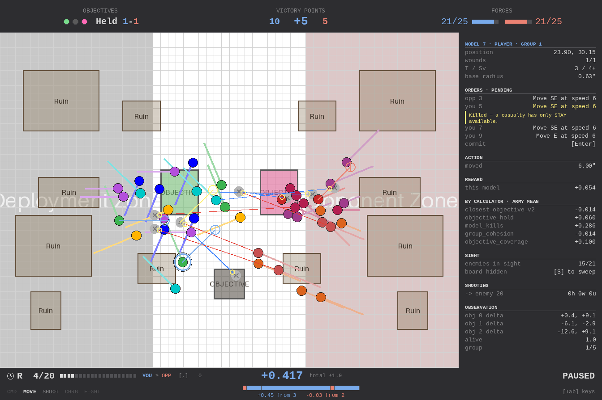

# Movement & Action Space

## Union Action Space

Every model shares a single flat discrete action space. The space is partitioned into contiguous **slices**, each owned by an action type and tagged with the battle phases where it is valid. An `ActionRegistry` manages these slices and produces phase-aware boolean masks so the agent (and opponent policies) never select illegal actions.

Current slices:

| Slice | Indices | Valid phases |
|-------|---------|--------------|
| `stay` | `0` | All phases |
| `movement` | `1 .. N×S` | Movement phase only |
| `shooting` | `N×S+1 .. N×S+T` | Shooting phase only (if opponents configured) |

With the defaults (`n_movement_angles=16`, `n_speed_bins=6`) and no opponents, the total action space is **97** (1 stay + 96 movement). With opponents, shooting target indices are appended (see [shooting.md](shooting.md)).

### Action Masking

During each step, the environment generates a `(n_models, n_actions)` boolean mask based on the current `BattlePhase`. The mask is:

- Attached to the observation (`WargameEnvObservation.action_mask`).
- Threaded through the observation tensor pipeline as tensor 5, a `torch.bool` tensor (`model/common/observation.py`).
- Applied by **PPO** inside `TransformerNetwork.policy_from_encoded`, which fills masked logits with `-inf` before the categorical distribution is formed — so sampling, log-probs, and entropy all see only legal actions.
- Applied by `ArgmaxAgent` (`model/common/argmax_agent.py`) during greedy selection, which sets invalid logits to `-inf` before the argmax, and restricts random exploration to valid indices. This is the path `simulate.py` and `measure-phase-gates` take.

### Extending with New Phases

To add actions for a new phase (e.g. charging), register a new slice in `ActionHandler.__init__`:

```python
self._registry.register(
    "charging",
    n_charging_actions,
    frozenset({BattlePhase.charge}),
)
```

This appends the new actions after the existing slices. The mask generation, observation pipeline, and network output layer automatically account for the larger `n_actions` — no other wiring changes are needed beyond implementing the action application logic itself. Shooting already follows this pattern (see [shooting.md](shooting.md)).

An action can be valid in multiple phases by including them in the `valid_phases` frozenset (e.g. `stay` is valid in all phases).

## Movement Encoding

Each model's movement action is a single integer from `1` to `n_movement_angles × n_speed_bins` (index `0` is the phase-universal stay action):

| Action | Meaning |
|--------|---------|
| `0` | Stay (no movement) |
| `1 .. N×S` | Move with a specific (angle, speed) pair |

For movement actions, the angle and speed indices are decoded as:

```
angle_idx = (action - 1) // n_speed_bins
speed_idx = (action - 1) %  n_speed_bins
```

## Direction

Angles are evenly spaced around the full circle starting at 0 radians (east / +x) and going counter-clockwise:

```
angle = 2π × angle_idx / n_movement_angles
```

With 16 angular bins, each bin is 22.5° apart:

| Index | Angle | Direction |
|-------|-------|-----------|
| 0 | 0° | East |
| 1 | 22.5° | ENE |
| 2 | 45° | NE |
| 3 | 67.5° | NNE |
| 4 | 90° | North |
| 5 | 112.5° | NNW |
| 6 | 135° | NW |
| 7 | 157.5° | WNW |
| 8 | 180° | West |
| 9 | 202.5° | WSW |
| 10 | 225° | SW |
| 11 | 247.5° | SSW |
| 12 | 270° | South |
| 13 | 292.5° | SSE |
| 14 | 315° | SE |
| 15 | 337.5° | ESE |

Board `y` increases *downward* (row 0 renders at the top), so the compass labels above read correctly only on a y-up plot: index 4 (+90°) displaces a model toward the bottom of the rendered board.

## Speed

Speed bins are linearly spaced from `max_move_speed / n_speed_bins` up to `max_move_speed`:

```
speed = max_move_speed × (speed_idx + 1) / n_speed_bins
```

With the defaults (`max_move_speed=6`, `n_speed_bins=6`), the available speeds are 1, 2, 3, 4, 5, 6 cells per step.

## Displacement Calculation

The board is continuous, so the displacement is applied **exactly**:

```
dx = speed × cos(angle)
dy = speed × sin(angle)
```

This used to be `round(...)`, snapping every move to a whole cell, and it was
destroying information rather than approximating it. On the 25v25 action space
the 96 movement actions collapsed to **80 distinct outcomes** — 16 pairs the
policy could not have told apart in the one head that steers — and a "speed 1"
diagonal travelled 1.414 against an orthogonal move's 1.000, so the cheapest way
to cover ground was to face diagonally.

All displacements are pre-computed at environment initialization for efficiency.
The board edge is clamped into the displacement to `[r, r] .. [width - r, height - r]`
for a model of base radius `r`, **before** collisions are resolved.

### Seeing the discretisation

`just debug` makes the bins visible: click open ground with a model selected and it is
ordered there, but the ghost is drawn at the **decoded landing point** rather than at the
click. The gap between the two is exactly the angle-and-speed quantisation the policy is
choosing under. An order the action mask refuses is drawn too, in the casualty colour, with
the reason — a dead model has only `STAY`.



## Collision

With `base_radius > 0` a model occupies ground, and moves are resolved against
the other models (`domain/movement.py`):

| | rule |
|---|---|
| enemy base | blocks the path — the move stops at contact |
| friendly base | may be crossed, but not **ended on** |
| resolution order | sequential, by model index |

The asymmetry is deliberate: walking through an enemy line is the one thing
models physically cannot do, while a squad moving as a body would gridlock on
its own front rank if friendlies blocked too. Sequential resolution gives model 0
a documented right of way, and that is the price of a board that is the same
every time the same actions are played.

At `base_radius: 0.0` — the default — none of this applies and movement is
exactly what was asked for, which is what keeps every result measured before
models had bases reproducible.

> **A tangential slide was tried and measured worse.** Blocked models otherwise
> queue radially behind whoever reached the objective first, so a sideways step
> around the obstruction is the obvious fix. Measured on the polygon scenario at
> n=30 on identical layouts, `squad_march_shoot` went 0.70 / +20.6 vp_margin to
> 0.57 / +1.0 with the slide in. A *fully* blocked model has its whole move left
> to spend, so the slide becomes a full-length swing away from the objective:
> models drift laterally, stay in the open longer, and are shot. The real fix is
> on the policy side — distinct target slots around an objective, rather than
> aiming every model at the centre.

## Configuration

Movement parameters are set via `WargameEnvConfig`:

| Parameter | Default | Description |
|-----------|---------|-------------|
| `n_movement_angles` | `16` | Number of angular bins (22.5° apart) |
| `n_advance_speed_bins` | `0` | Advance bins, as their own action slice appended after shooting. 0 registers nothing, draws no dice and changes no action index |
| `dark_action_slices` | `[]` | Slice names registered at full width but valid in **no** phase, so every one of their actions is masked all episode. Exists to restore *pairing* to an action-space arm: the arm and its control then share a parameter shape and start from bit-identical weights. ⚠ It does not make an existing control reusable — a narrower head consumes less RNG at init, so the control must be retrained with the slice darkened |
| `n_speed_bins` | `6` | Number of discrete speed levels |
| `max_move_speed` | `6.0` | Maximum distance a model can move per step, in inches. The scenario-wide default for the rules' **Move (M)** characteristic |
| `ModelConfig.move` | `None` | Per-model override of `max_move_speed`, in inches. `None` takes the scenario value |
| `base_radius` | `0.0` | Model base radius, in inches. `0.63` is the rules' 32mm infantry base |

These can be overridden in YAML environment config files:

```yaml
n_movement_angles: 16
n_speed_bins: 6
max_move_speed: 6.0
base_radius: 0.63
```

## Per-Model Speed

`ModelConfig.move` is the rules' **Move (M)** characteristic, in inches. A model
that sets it uses its own maximum in place of `max_move_speed`:

```yaml
models:
  - { group_id: 0, move: 10.0 }   # a fast squad
  - { group_id: 1 }               # takes max_move_speed
```

The action space is **uniform across models**: the bin *count* never changes, so
"speed bin 3 of 6" means "half of my own maximum" whatever that maximum is, and
the network architecture is untouched. Each side's handler is built from its own
model list, so the two armies can move at different speeds.

Two things to know:

- **A uniformly-fast army is byte-identical to one that never set the field.**
  The shared displacement table is kept verbatim in that case rather than being
  re-derived as fractions × M, because the two are not the same float: at M = 6,
  `6.0 / 6` is exactly `1.0` while `linspace(1/6, 1, 6)[0] * 6` is
  `0.9999999999999999`.
- **M is not in the observation yet.** With every model equally fast the network
  does not need it, but under genuinely differing speeds the same action index
  would mean different distances to different models with nothing in the tensor
  saying so. Adding it widens the per-model token, which orphans every
  checkpoint — see `docs/rules/implementation-status.md`.
