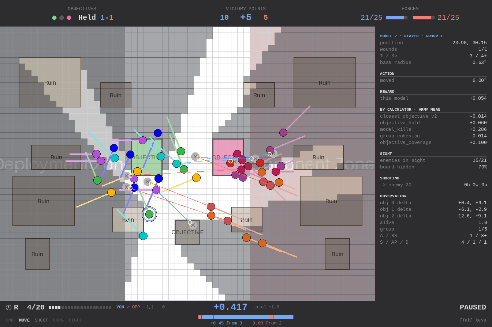

# Terrain & Line-of-Sight Blocking

## Overview

Terrain (Ruins) blocks **line of sight only**: a terrain piece is a **closed outline** — a rectangle is just the common case — and the outline itself is the LOS blocker. Movement is unaffected by terrain; models move through and stand inside a footprint freely. (Models do block *each other* once they have bases: see [movement.md](movement.md).)

A ruin blocks the line between two models only when its footprint lies between them and **both** models are outside it. A model inside a ruin can see out and be seen into (see-out / see-into exceptions, evaluated per ruin independently).

## Configuration

Terrain is configured in YAML via the `terrain` key on `WargameEnvConfig`. Each terrain piece is a footprint rectangle given as two opposite corners `[x0, y0, x1, y1]` in absolute board coordinates.

```yaml
board_width: 60
board_height: 44

terrain:
  - { footprint: [27, 8, 33, 16] }
  - { footprint: [27, 28, 33, 36] }
```

### Validation

Footprint corners are normalised (so `x0 ≤ x1`, `y0 ≤ y1`) at config load. The following are rejected with a clear error:

- A corner that falls outside the board dimensions
- Two footprints that overlap each other

Overlap with deployment zones and objectives is explicitly allowed.

## Random terrain

Setting `random_terrain` instead of `terrain` regenerates the layout at the start of every
episode, from the environment's seeded RNG. The two keys are mutually exclusive.

```yaml
random_terrain:
  count: 7        # number of pieces -- constant across episodes (see below)
  min_size: 5     # footprint side length, inclusive
  max_size: 7
  mirror: true    # reflect the layout across the vertical centre line
  edge_margin: 2  # keep footprints this far from the board edge
  min_gap: 1      # minimum clear cells between two footprints
```

**Why randomise.** A fixed layout makes any claim about terrain use unfalsifiable: a policy
that appears to take cover may only have memorised a handful of rectangles, and the two
produce identical numbers. A fresh layout each episode leaves only one way to score — read
the terrain tokens in the observation.

**`count` is fixed on purpose.** `observations_to_tensor_batch` stacks the terrain arrays of
a whole batch with `np.stack`, so
a batch containing episodes with different piece counts cannot be collated. Only size and
position vary. `tests/test_random_terrain.py` asserts this directly.

**`map_pool` is the third mode**, and it is how a run trains on the real tables: a whole
layout — terrain and objectives — is drawn per episode from a directory of map files, so a
run sees the distribution 36 real boards describe rather than one board or a generator's
idea of one. All three modes are mutually exclusive. The pool is parsed and checked once at
construction, the draw comes off the layout RNG so a seeded reset picks the same table
twice, and `env.map_name` says which one. `names` splits the pool — training on all 45
consumes the evaluation set. See `configs/experiments/25v25_real_maps.yaml`.

**`terrain_budget` is the way round that**, and the reason it exists is the real layouts:
`configs/evaluation/maps/` carries 15 or 16 pieces depending on the table, which `np.stack`
refuses. Setting it pads the token *sequence* to a fixed length with all-zero rows, which the
network drops from attention — no new column is needed to mark them, because a padding row's
vertex count is zero and no real piece has zero vertices. It defaults to None, which is
byte-identical to a config without it, and setting it changes the input shape, so existing
checkpoints fail to load. See `tests/test_observation_budgets.py`.

**`mirror` keeps the sides even.** Deployment zones are fixed to the left and right of the
board and `turn_order` only swaps who moves first, so an asymmetric draw would hand one side
better approaches for a whole run. With an odd `count`, one piece straddles the centre line
and is its own reflection.

Generation is rejection sampling. Specs that pack the board too tightly, or whose `max_size`
cannot fit inside the margins, are rejected at config load rather than failing partway
through a run. The packing bound is on the **expected** footprint,
`count x ((min_size + max_size) / 2 + min_gap)^2` against half the usable area. Bounding the
worst case instead — every piece at `max_size` — rejects exactly the specs that produce
wall-shaped pieces, which need a large `max_size` beside a small `min_size`; sides are drawn
independently and uniformly, so an all-max layout is vanishingly unlikely.
`_MAX_LAYOUT_ATTEMPTS` in `terrain_placement.py` is the real backstop and raises with a clear
message if a draw genuinely cannot be placed.

### Choosing a profile: count dominates size

`just measure-terrain <config> [n_layouts]` samples layouts and reports what a profile is
actually worth. The number that matters is **not coverage** but *cells hidden from a squad*:
the fraction of board cells from which no member of a squad-sized enemy group in weapon range
has line of sight. Exposure is "at least one enemy can see me", so terrain that breaks a few
sightlines out of twenty-five buys nothing — hiding means breaking every one at once.

Measured on 60x44 with weapon range 12:

| profile | coverage | sightlines blocked | **cells hidden from a squad** |
|---|---|---|---|
| 7 x 5-7 (batches 1-2) | 0.096 | 0.045 | **0.058** |
| 15 x 3-10 | 0.212 | 0.103 | 0.114 |
| 11 x 3-12 | 0.199 | 0.080 | 0.101 |
| 25 x 3-8 | 0.244 | 0.159 | 0.168 |
| **29 x 3-7 (batch 3)** | 0.251 | 0.179 | **0.198** |

> **These numbers were measured under the Bresenham trace and do not carry over.** Re-measured
> under the sampled ray, the same 29 x 3-7 rectangle profile scores **0.167**, not 0.198 — the
> sight change moved the metric on its own. Convex *outlines* hide less again (0.158 at the same
> count and size), and they pack tighter, so the direction that recovers it is more, smaller
> pieces: 37 x 3-6 hexagons scores **0.192** at *lower* coverage. Re-derive a profile with
> `just measure-terrain` rather than porting a row from this table.

At equal coverage, **many small pieces beat few large ones** — hiding needs ruins in many
directions, not one big one. This is why batches 1-2 could not answer the cover question:
with 5.8% of the board hidden, the agent was not declining to use cover, there was almost
none to use. Tune a profile here, in seconds, rather than after a thousand epochs.

The cost is sequence length: terrain is one transformer token per piece, so 29 pieces plus
the (since-removed) threat feature measured 2.66 -> 3.13 ms/step on 25v25 (+18%).

## Real table layouts

Training uses `random_terrain`; the boards the game is actually played on are
fixed. Those live in `configs/evaluation/maps/` as terrain-only files:

```yaml
name: table_01
terrain:
  - { footprint: [12, 8, 18, 14] }
```

`just measure-maps <policy|ckpt> <config> [n] [maps_dir]` runs the scenario
unchanged and swaps only `terrain`, one row per map plus the spread across
them. The map replaces `terrain` *and* clears `random_terrain` — the two are
mutually exclusive, and a surviving generator would regenerate a layout at
reset and discard the map.

There is no config per map by design: see [configs/README.md](../configs/README.md).

## Objectives and terrain

Objective placement is independent of terrain by default, and independent of the other
objectives. Both defaults have measurable consequences on a 60x44 board with 3 objectives
of radius 3 and 7 random ruins (400 episodes):

| | frequency |
|---|---|
| two objective discs overlap (centres < `2 x radius`) | **25% of episodes** |
| an objective centre inside another objective's disc | 7.8% of episodes |
| an objective inside a ruin | **11% of objectives** |

Overlapping discs quietly turn a three-objective mission into a two-objective one, which
matters because a single stack already saturates every occupancy metric. An objective
inside a ruin is not covered ground either — the see-out / see-into rule means a model
standing there can still be seen and shot by anything outside the ruin, so the ruin
protects nobody while still blocking that lane for everyone else.

Two config keys constrain the draw. Both default to `None` (the historical behaviour) and
are applied by rejection sampling in `objective_placement`:

```yaml
objective_min_separation: 6     # >= 2 x objective_radius_size keeps discs disjoint
objective_terrain_clearance: 5  # keeps the contested ground out of ruins
```

Placement is best-effort: if the retry budget is exhausted the last candidate is used, on
the grounds that a crowded layout beats a failed episode. Enabling either key changes the
scenario distribution, so runs measured with and without them are **not** comparable.

## Measuring cover use

Terrain blocks line of sight and nothing else, so "taking cover" means exactly one thing:
positioning so no enemy has line of sight to you. Two metrics measure it, both gated behind
`track_exposure: true` (default off; it costs one extra shooting-mask build per shooting
phase, measured at ~4% of step time on the 25v25 configs).

| Metric | Meaning |
|---|---|
| `firepower_ratio` | **Prefer this one.** Over the episode, (our alive models with a reachable target) ÷ (theirs with one). 1.0 is an even exchange |
| `exposure_rate` | Fraction of alive model-shooting-phases where at least one alive enemy has **line of sight and weapon range** to that model |
| `terrain_proximity` | Mean distance from an alive model to the nearest footprint (0 inside) |

All three surface as `eval/*` keys during training and as columns in
`just measure-baselines` and `just measure-checkpoint`. All are `None` — printed as `-` —
when unmeasured, never `0.0`, which would read as "never exposed".

`exposure_rate` counts only *our* side of the exchange, so it falls both when a policy
manoeuvres into a good fight and when it hides from every fight. `firepower_ratio` is the
difference between the two sides and separates them. Line of sight is exactly symmetric here,
but symmetry is *pairwise* — it does not equalise the counts, which is precisely what makes
cover worth using: it lets you choose the exchange ratio.

Both deliberately **ignore** the engagement-range and advanced gating that the real shooting
mask applies. A shooter within `engagement_range` of any enemy cannot fire at all, so folding
that in would score a headlong charge as if it were cover.

See [metrics.md](metrics.md#cover-metrics) for the reading rules — in particular that
`exposure_rate` is a mean over *alive* models, which makes it fall when models die.

## Seeing terrain at decision time — the policy cannot

The policy has **no line-of-sight information at movement time at all**, which is when the
decision is made. The shooting mask is built only during the shooting phase and only masks
logits, so it never reaches the encoder. Terrain rectangles and enemy positions are both in
the observation, so exposure is derivable in principle — by the network learning to ray-cast
over 625 pairs internally, which it will not.

`observe_threat_count` supplied one: a per-model scalar giving the fraction of the opposing
force with line of sight **and** weapon range to that model. Batch 3 ran it as one axis of a
2x2 across two seeds and it measured **null** — no effect alone, and slightly negative when
combined with the loss penalty. It was removed rather than kept as dead configuration. See
[the report](../reports/2026-08-06-cover-signal-reason-geometry.md).

The reading that survives is about the *encoding*, not the idea. A threat **count** says how
many guns bear on a model but not from where, so it cannot support the decision cover
actually requires: "step two cells left and the wall covers me". A directional or per-sector
encoding is untested.

Two implementation notes worth keeping if one is ever built:

- **Compute it inside `build_observation`**, so the value describes where a model is *now*.
  Caching it during the opponent's turn is stale within the round: with the usual
  `skip_phases`, movement advances to shooting with the same side still active, so the
  opponent hook never runs on a movement step and the cached value describes the cell the
  model just left.
- **The new column goes inside `core`, before `alive`.** `TransformerNetwork._alive_feature_index`
  counts backwards from the last column, so appending after the combat stats makes the
  key-padding mask read `wound_ratio` as `alive` — silently, with no exception.

### No-Terrain Default

When `terrain` is omitted or `null`, the environment behaves exactly as before — no terrain objects are created, no observation tokens are added, and pre-terrain checkpoints continue to load and infer correctly.

## Domain Model

The pure domain lives in `domain/terrain.py`:

| Class | Description |
|-------|-------------|
| `Footprint` | Frozen dataclass: `x0, y0, x1, y1` with `contains(x, y)` and `from_corners()` factory |
| `Terrain` | Collection of footprints; `blocking_footprints_for_endpoints(x0, y0, x1, y1)` returns footprints containing **neither** endpoint |

`Terrain` is static per episode — it is constructed from config during `battle_factory.from_config()` and does not change during play.

## DDD Wiring

```
WargameEnvConfig.terrain  →  battle_factory  →  Battle.terrain
Battle.terrain  →  BattleView.terrain (Protocol property)
WargameEnv  →  delegates to Battle (implements BattleView)
```

`BattleView.terrain` is the read-only interface that renderers, reward calculators, and the observation pipeline use to access terrain without depending on the full env.

## Line-of-Sight Blocking

LOS blocking is **endpoint-aware**: the blocking predicate is evaluated per query, not pre-computed as a static grid.

### Algorithm

For a query from point `(x0, y0)` to point `(x1, y1)`:

1. A footprint containing **either** endpoint is exempt for that query — the see-out / see-into rule. Membership here is **edge-inclusive**, so a model standing exactly on a ruin's edge is standing *in* it and is not blocked by its own cover.
2. A **strictly interior** sample along the ray is blocking if (both endpoints are exempt, and models never occlude — only the static mask and footprints block):
   - `config.blocking_mask[y][x]` is True (legacy static blocking), **OR**
   - The sample lies inside any non-exempt outline. Sample membership is interior-only: it is measure-zero and on the hot path.
3. Symmetry is exact by construction — the pair (A, B) and the pair (B, A) sample the same parametric positions on the same segment, so the same blockers are tested. `firepower_ratio` depends on it, reading an exposed model as one that can also fire.

The sampled-ray core in `domain/los.py` knows nothing about terrain: it takes padded outlines and traces segments against them, vectorised over segments *and* over shapes. Steps 1–3 above are `domain/sight.py`, which composes that primitive with the domain model (`terrain.py`) and the static mask.

`sample_step` (config: `los_sample_step`, default 0.25") is the resolution guarantee: a blocker thinner than it can fall between two samples and leak sight. `BattleView.line_of_sight_matrix` is the entry point everything hot uses; `has_line_of_sight_between_points` is a single-pair convenience for the renderer and for tests, and calling it in a loop is a measured 3x regression.

### See-Into / See-Out Rules

The Ruins rules state that a model inside a ruin can see out, and models outside can see into a ruin. This is implemented by the "neither endpoint" filter: a footprint only participates in blocking when both the observer and the target are outside it.

| Observer | Target | Footprint between them? | LOS |
|----------|--------|------------------------|-----|
| Outside | Outside | Yes | **Blocked** |
| Inside | Outside | N/A (observer inside → footprint excluded) | Clear |
| Outside | Inside | N/A (target inside → footprint excluded) | Clear |
| Inside | Inside | N/A (both inside → footprint excluded) | Clear |

Each footprint is evaluated independently. A model inside ruin A can still have LOS blocked by ruin B if both endpoints are outside B and B lies on the ray.

### Integration

Because all LOS queries route through the single `line_of_sight_matrix` seam on `BattleView`, the following all agree on the same terrain blocking:

- Shooting masks (action masking)
- Shooting resolution (damage)
- Renderer debug LOS overlay
- Any future LOS consumer

## Movement

Terrain does **not** affect movement. Models can move through and stand inside a footprint freely. This is verified by `test_terrain_movement_through_footprint` in `tests/test_env.py`. Other *models* do obstruct, once they have a base — see [movement.md](movement.md).

## Observation

Terrain footprints are encoded in the agent's observation as **entity tokens** — one token per footprint, appended after opponent models.

### Token Layout

Each terrain token carries the piece's **outline**, not its bounding box: `TERRAIN_VERTEX_BUDGET` vertices padded by repeating the last one, normalised to [-1, 1] by the board half-dimensions, plus the real vertex count. This is the first encoding that can tell an L-shaped ruin from a solid block — every cover experiment before it ran against four numbers that made those identical.

Two paddings, at right angles to each other: `TERRAIN_VERTEX_BUDGET` pads *within* a token so pieces of different vertex counts share a width, and `terrain_budget` pads the *sequence* so layouts of different piece counts share a length. The vertex count column tells both apart from real data — it is fractional on a real piece and zero on a padding row.

Historically the token was:

| Feature | Description |
|---------|-------------|
| `x0_norm` | Left edge, normalised to [-1, 1] |
| `y0_norm` | Top edge, normalised to [-1, 1] |
| `x1_norm` | Right edge, normalised to [-1, 1] |
| `y1_norm` | Bottom edge, normalised to [-1, 1] |

Normalisation uses `(corner - half_board) / half_board`, consistent with model and objective location normalisation.

### Tensor Pipeline

The observation tensor pipeline returns 6 tensors:

| Index | Tensor | Shape |
|-------|--------|-------|
| 0 | Game features | `(6,)` |
| 1 | Objectives | `(n_objectives, 2)` |
| 2 | Player models | `(n_models, feature_dim)` |
| 3 | Opponent models | `(n_opponents, feature_dim)` |
| 4 | **Terrain** | `(n_terrain, 17)` |
| 5 | Action mask | `(n_models, n_actions)` |

With no terrain configured, the terrain tensor has shape `(0, 17)` — zero rows, fixed width. This ensures no mid-episode observation shape change.

### Network Integration

**TransformerNetwork**: A `terrain_embedding` linear layer projects terrain tokens into the transformer embedding space. Terrain tokens are appended **last** in the token sequence (after opponents) and are always attendable (no alive/dead masking). When `terrain_size == 0` (no terrain), `terrain_embedding` is `None` and no tokens are appended — the network state dict is identical to a pre-terrain checkpoint.

Token sequence: `[game, objectives..., players..., opponents..., terrain...]`

Player and opponent token positions are unchanged by the presence of terrain, so per-model action heads and the critic token are unaffected.

## Rendering

The renderer draws terrain footprints as translucent brown rectangles with an outline and "Ruin" label, drawn after deployment zones and before models. The debug LOS overlay line is coloured by the actual blocked/clear verdict (green = clear, red = blocked).

`just debug` can also shade everything the selected model cannot see, by sampling
`line_of_sight_matrix` on a one-inch grid — the staircase edges are that sampling, not the
terrain. It is the fastest way to check a layout's sightlines against the engine's own answer
rather than against the geometry you think you drew.



## YAML Example

A complete config with terrain (`configs/dev/terrain_los_demo.yaml`):

```yaml
config_name: terrain_los_demo
board_width: 60
board_height: 44
number_of_wargame_models: 4
number_of_opponent_models: 4
number_of_objectives: 3
number_of_battle_rounds: 5

deployment_zone: [0, 0, 20, 44]
opponent_deployment_zone: [40, 0, 60, 44]

opponent_policy:
  type: scripted_advance_to_objective

terrain:
  - { footprint: [27, 8, 33, 16] }
  - { footprint: [27, 28, 33, 36] }

objectives:
  - { x: 30, y: 6 }
  - { x: 30, y: 22 }
  - { x: 30, y: 38 }
```

Two ruin footprints flank the middle objective along the centre line. Models must navigate around or through the ruins to establish line of sight to opponents on the other side.

## Future Extensions

The following terrain features are deferred to later milestones:

| Feature | Description |
|---------|-------------|
| Walls | Thin L-shaped segments within a footprint for finer-grained LOS and rendering |
| Dense/Woods | "Not fully visible" partial obscuring distinct from the Ruins block |
| Cover bonus | +1 armour save vs ranged when not fully visible due to terrain |
| Difficult terrain | Movement speed penalty |
| Impassable terrain | Models cannot move through |
| Elevation | Height advantage (+AP from elevated positions) |
| Board templates | Named layouts (a corridor, a courtyard) rather than uniform random rectangles |
