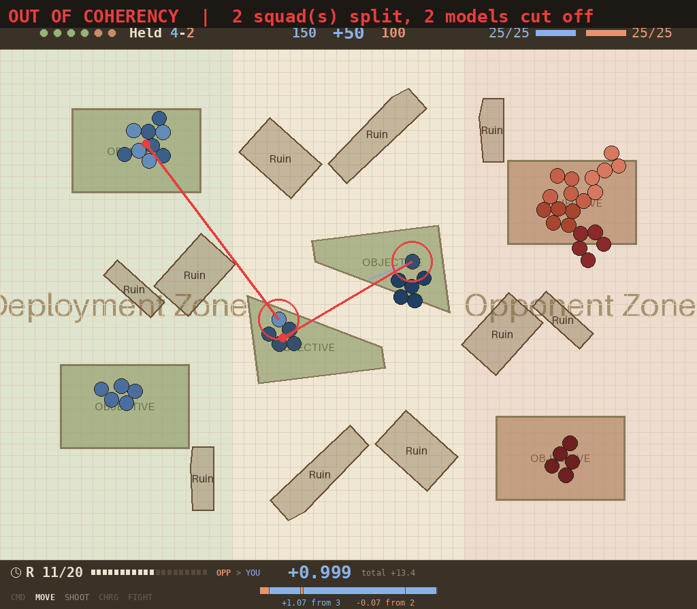
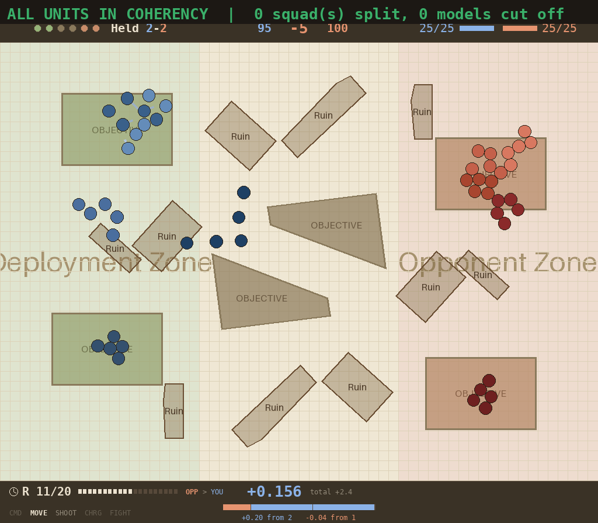
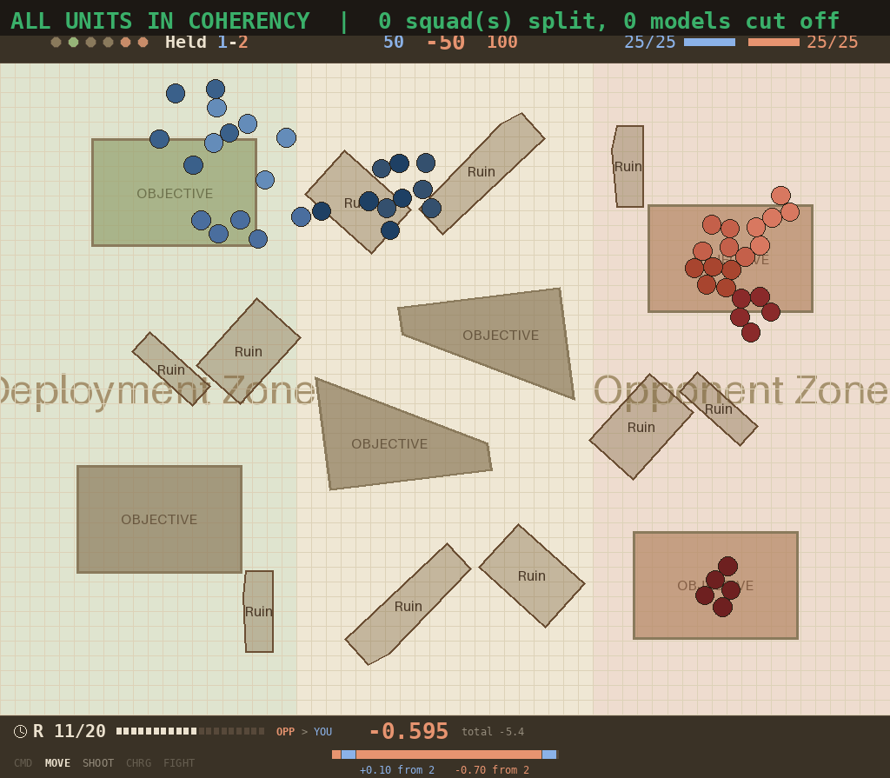

# Coherency: the verdict

**2026-08-15.** Closes the question opened by
[coherency is a symptom](2026-08-14-coherency-is-a-symptom.md) and continued in
[what it costs](2026-08-14-coherency-what-it-costs.md), **both of which this
report corrects**. Scenario throughout: the real tables
(`configs/experiments/25v25_maps_*`). Every score is `just measure-checkpoint`
at **n=100, seeds 700000-700099, identical layouts**, on the config named.

---

## Verdict

**An agent can play in full unit coherency, and it is sometimes free and
typically costs about a tenth of its score.**

| | coherency | `vp_margin` |
|---|---|---|
| unconstrained control | ~0.55 | **+98.6** |
| best constrained checkpoint | **1.000** | **+100.4** |
| constrained, mean of 7 | 1.000 | **+89.8** |
| constrained, worst | 1.000 | +63.7 |

Compliance is exact where it matters: `just measure-coherency` on the 40-epoch
checkpoint reports **units coherent 1.000, steps 0.998, 0.00 of 25 models
adrift**, under the strict 2"/9" chain-spread-connectivity predicate.

**It requires a two-stage recipe and will not work any other way.**

---

## What it looks like

All three frames are the **same layout and seed (700000), the same round 11**,
rendered from real checkpoints. Rings and lines are drawn from
`evaluate_coherency` itself -- the predicate the metric and the enforcement both
use -- so the annotation is the engine's own answer, not the figure's.

### The defect: squads split across the board

The unconstrained control, `require_coherent` off. **Each red line is one squad
torn in half**: a ringed model at one objective, a dot at the body it left, and
the gap between them. Both breaches are the *defection* pattern -- the model has
not drifted a few inches, it has walked to a **different objective** from its
squad. That is 82.4% of adrift models, at a median 13.6 board units against a
9.0 cap.

Note what the figure would look like if every flagged model were ringed: the
spread condition is **collective**, so one model over the cap puts the whole
unit in breach and the frame rings two tightly packed clusters -- which reads as
"packed models are illegal", the opposite of the truth. Only the splinter is
ringed here.

### The fix: the same board, in formation

A constrained checkpoint on the identical layout: **zero squads split, zero
models cut off**, every unit a recognisable clump. This is what
`measure-coherency`'s "units coherent 1.000, 0.00 models adrift" looks like.

Read the HUD honestly: at this instant the constrained policy is **behind**
(held 2-2, −5) where the unconstrained one is 4-2, +50. Formation costs tempo
early. The episode-level scores in the tables above are what settle it.

### The trap: compliance is not the goal

A policy trained under the rule **from scratch**, and the caption is green:
**"ALL UNITS IN COHERENCY — 0 squads split"**. It is perfectly compliant and
scoring **−50**, loitering in its own deployment zone with **three objectives
completely empty**. Every move that would break formation was blocked, so it
learned not to move.

This is the single most important picture here. **A coherency metric alone
cannot tell this apart from the frame above it** -- both read 1.000. That is why
every claim in this report is quoted as `vp_margin` *and* compliance, and why
the warm-start warning now sits on the config field.

---

## The recipe

1. **Train normally**, with `objective_hold.require_coherent: true`.
2. **Warm-start into `coherency.enforce_move`** and continue.

### Stage 1 is the lever that made coherency learnable

`require_coherent` pays a model **nothing** from `objective_hold` while it sits
outside its unit's coherent body. Not less -- nothing. The argument is the
user's: a detached model is not a legal state of the game, so it should not be
paid at all.

| | `coherency_rate` | models adrift | `vp_margin` | `held` |
|---|---|---|---|---|
| control | 0.52-0.65 | 2.9-3.7 | +98.6 | 3.45 |
| `unit_coherency` bonus (saturated) | 0.67 | 2.5-2.9 | - | - |
| **`require_coherent`** | **0.708 / 0.849** | **2.33 / 1.24** | **+95.8 / +96.2** | **3.41** |

Two seeds, 300 epochs, warm-started. Coherency rises from ~0.55 to a mean of
0.78 and models adrift roughly halve, with `held` **3.41 against the control's
3.45** -- so unlike `surplus_value` and the overstack penalty, it steers
objective play without suppressing it. It was **still improving at epoch 300**
(0.817 -> 0.883 over epochs 64-292), so its ceiling is unknown.

It does **not** reach rules accuracy on its own: 0.85 is not 1.000.

### Stage 2 is mandatory, and training from scratch does not substitute

| training | `vp_margin` |
|---|---|
| from scratch, `revert_unit` | **−75.3** |
| from scratch, `clamp` | **~−25** (plateaued, epochs 96-164) |
| from-scratch control, no rule | **+90 by epoch 40** |

A near-random policy has every move blocked, correctly learns that moving does
nothing, and never recovers. This is the single most important practical fact
here: **switching coherency on in a config and training will collapse the run**,
and anyone who tries it will reasonably conclude the feature is broken.

### The warm-start source matters, and the split is clean

Every constrained checkpoint scored, grouped by which policy it warm-started
from:

| warm-start source | n | mean | range |
|---|---|---|---|
| **`require_coherent` policy** | 7 | **+89.8** | +79.8 to +100.4 |
| plain control policy | 3 | +70.2 | +63.7 to +75.6 |

**No overlap** -- every gated-basin checkpoint outscores every control-basin one.
Caveat that keeps this suggestive rather than settled: the two groups are **not
matched on epochs** (control-basin runs sit at ~105 and 300, gated-basin at 22
to 300), and by branch tally alone it is 3 of 4 against 0 of 3, Fisher p ≈ 0.14.

---

## Why it costs anything: the drift

The constraint is absorbed within ~10 epochs -- compliance is immediate. What
follows is the policy slowly learning a **timid style**: it keeps models alive
and stops contesting ground. Windowed means, three runs:

| epochs | s4-basegate | s3-basegate | s3-basectrl |
|---|---|---|---|
| 20-60 | **90.4** | **85.3** | 79.5 |
| 100-140 | 81.5 | 80.8 | 76.3 |
| 180-220 | 78.5 | 79.5 | 66.2 |
| 260-299 | 78.2 | 80.6 | 65.0 |

**`fraction_alive` predicts `vp_margin` monotonically across every checkpoint
scored**, which is the drift measured directly:

| `alive` | 0.926 | 0.945 | 0.957 | 0.966 | 0.973 | 0.976 | 0.980 | 0.985 |
|---|---|---|---|---|---|---|---|---|
| `vp_margin` | 100.4 | 92.2 | 92.2 | 95.2 | 85.6 | 83.5 | 63.7 | 79.8 |

The best constrained checkpoints have **lower** `alive` than the unconstrained
control (0.926-0.945 v 0.957) -- they fight *harder*, not less. The cost is not
the rule; it is what the policy becomes if it trains under the rule too long.

### Early stopping is the obvious fix and it did NOT reproduce

Within a run, the early checkpoint is much better: s3-basegate **+100.4 at epoch
22 v +85.6 at 300**, s4-basegate **+92.2 v +79.8**. That looked like a recipe.

It is not. Two fresh seeds trained on a **40-epoch schedule** scored +83.5 and
+92.2, mean **+87.9 -- no better than the 300-epoch mean of +86.9**.

The epoch-22 checkpoints were kept by `save_top_k` because *training reward*
peaked there, so comparing them against an unselected endpoint measures the
selection, not the schedule. Same family as the documented trap about screening
arms by their latest top-k checkpoint. **The gain was selection.**

What survives: the drift is real, but its *timing varies by seed* (s5 had
already drifted to `alive` 0.976 by epoch 40 while s6 sat at 0.957), so no fixed
epoch count controls it. The untried lever is **selecting a checkpoint on eval
`vp_margin` or on `alive`, rather than on training reward** -- a
checkpoint-selection change, not a training one.

---

## What did not work

- **`unit_coherency` reward** -- a per-model bonus for standing with the squad.
  Monotone but saturating (0.562 -> 0.621 -> 0.659 -> 0.674) with `vp_margin`
  unchanged. Free, and not the mechanism.
- **Observation only** -- `observe_coherency` with no reward: **null**.
- **`objective_hold.marginal_weight`** (pay `V(p) − V(p−1)`) -- did not test its
  own hypothesis. It collapsed this term's income **0.176 -> 0.014**, deleting
  it rather than redirecting it, because a difference reward pays zero on any
  securely-held objective. Coherency sat flat at 0.55 for 170 epochs. The
  surviving lesson is stronger than the intended one: **whether `objective_hold`
  pays for defection or pays nothing, coherency is 0.55 — the *level* of
  objective pay is not what drives detaching; making income conditional on
  legality is.**
- **`enforce_move_probability` sweep** -- no knee; p=0.75 is dominated by p=1.0
  on both coherency and vp. A move undone sometimes and not others is not a rule
  anything can learn. **Do not re-run.**
- **`gated_clamp` (gate + constraint together)** -- ill-conceived. Under full
  enforcement the gate is **definitionally inert**: coherency is 0.999, nothing
  is ever detached, and `require_coherent` only bites on a detached model. Its
  stated mechanism was refuted directly -- reverts/step **6.79 v 6.34** ungated,
  because the gate reduces breach *severity*, not *frequency*. Killed at epoch
  146, flat and indistinguishable from plain enforcement.

### One thing built along the way

`coherency.enforce_move: clamp` -- a third enforcement mode that **shortens** a
move along its own segment instead of cancelling it, falling back to a full
revert when no legal point exists. Added to remove the from-scratch
credit-assignment pathology. It measurably does (−25 v `revert_unit`'s −75.3)
and is still not viable from scratch. **All three modes cost the same on
impact** (+104.2 -> +76.7 / +75.8 / +78.3 for the same weights), so the mode
choice is settled and that comparison should not be re-run.

---

## Retractions

Coherency's cost was reported, in order, as **~28 -> ~10 -> ~15 -> ~3.4 -> ~12
-> ~10 with a range of 0 to 35**. Every figure was a real measurement. They
failed on:

- **n=6 where per-episode sd is 45-50** (SE ~19) -- could not resolve a 12 vp
  effect, and was used to claim a 28 vp one.
- **Comparing across layout sets** -- the same deterministic scripted policy
  scores **+67.5 at seeds 10000+ and +93.5 at seeds 700000+** on one config.
  This moved three separate conclusions in one session.
- **Comparing against an unenforced bar** -- the scripted bar's +105.6 at
  coherency 0.837 is not a compliant policy, and 0.837 is not compliance.
- **Quoting the best of four seeds** (+3.4) as the answer.
- **Reading a bifurcation into four points** -- "bimodal branches" is one
  continuous drift traversed at different speeds.
- **Comparing a selected checkpoint against an unselected endpoint** -- the
  early-stopping result above.

## Method notes

- **Always pass `seed_base`, and score agent and baseline on identical
  layouts.** Score enforced arms against `just measure-baselines` on the
  **enforced** config.
- **`eval/coherency_rate` is coarse** -- sampled once per movement phase and
  confounded with squad size. It reported 1.000 where `just measure-coherency`
  reported 0.996. Trust the latter.
- **Enforcement cannot repair a unit split by casualties**, by design. The
  residual incoherence in one checkpoint was chain/split failures with **zero**
  spread failures, which is that signature exactly. `coherency.attrition` is the
  rung that closes it.
- **A watcher must count the runs it watches.** Three separate false alarms came
  from counting every `train.py` on the box, then every process of an arm.
  Grepping a command line for an arm name is ambiguous -- a config path
  (`25v25_maps_gated_clamp.yaml`) and a wandb group (`coherency-gated-clamp`)
  contain other arms' tags. Match the extracted `--run-suffix`, anchored.
  Separately, killing `uv run train.py` leaves the `python3 train.py` child
  running.
- **Print the denominator.** Two measurements here returned 0 shots and 0
  damaging shots and would have read as clean results without it.
