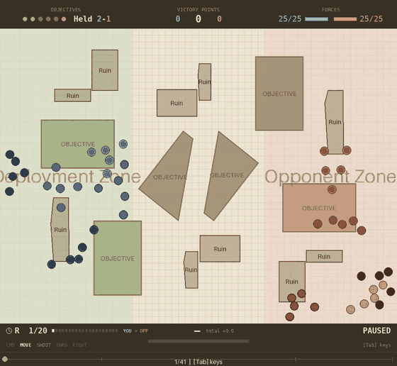

# The chain tail and the frozen army

**2026-08-18.** Why coherency-enforced play looks wrong on screen, what actually
causes it, and which of the obvious fixes are already dead.

Prompted by a plain observation from the user: *"the actual behaviour of the
models looks very wrong. they look like they are prevented from moving where
they want to move in order to win the game."*

They were reading the screen correctly. This report quantifies it, finds the
mechanism, and retracts a thesis of mine along the way.

---

## 1. The bill, measured

Trained agent under `enforce_move: revert_unit`, **and no attrition** — the play
setting as shipped at the time of measurement. Referee instrumented by capturing
(start, intended, final) positions for every movement phase, 40 episodes; scores
on the nine held-out tables, n=30 per map, identical layouts.

⚠ **These figures are not directly comparable to §9's.** Attrition was added to
the play config partway through this work (see § Landed), and every number in
§9 was taken with it on. Attrition is worth **+15 vp** to the agent, so the
tax figures here (−25.0 / −39.8) and there (−34.3 / −55.4) differ by both that
and the change in n. Where they disagree, §9 is the current configuration.

| | value |
|---|---|
| unit-moves frozen outright | **33.1%** (bar: 12.1%) |
| **intended movement inches destroyed** | **48.9%** |
| unit-episodes freezing at least once | 91.5% |
| movement phases with ≥1 frozen unit | 70.5% |
| cost to the agent | **−25.0 / −39.8 vp** |
| cost to `squad_march_take` | **−4.3 vp** |

A separate n=20 pass on the take-opponent config puts the freeze rate at 37.7%,
with a longest single freeze of **12 consecutive turns of a 20-round game** and
35 freezes lasting ≥5 turns.

**The tax is 2.3x asymmetric between the two sides in the same games** — player
0.331 frozen / 0.486 inches lost, opponent 0.142 / 0.284 — even though both
forces go through the same handler.

### What it looks like

One episode of the control checkpoint under `revert_unit` + `attrition`. The
piling is the thing to watch: ten of the player's models occupy a single
objective disc while other squads sit alone, which is the formation the geometry
predicts, since a tight blob is the only shape with slack to spare against the
2" chain.

## 2. Freezing is an absorbing state

`P(frozen next turn | frozen now) = 0.62`, against 0.17 after a move. 4.8% of
freeze runs last 10+ turns and **29 runs end only when the game does**.

The cause is that a revert *reproduces the same decision*: the policy sees the
same state next turn and re-issues the same move. For a deterministic policy it
is a hard deadlock — `squad_march_take` on seed 700029 requests the identical
24" move on all twenty rounds, is reverted every time, and finishes with twenty
models exactly where they deployed, losing 160-275.

**A revert cannot repair, only refuse.** A unit split by casualties is already
incoherent when its move begins, so reverting returns it to the split it started
from. Nothing in `enforce_move` can ever close that break.

## 3. The mechanism: a 7.8% tail amplified into a 33% veto

**The 2" chain binds. The 9" spread does not.**

| quantity | value |
|---|---|
| gap to nearest squadmate, median | **0.09"** |
| gap to nearest squadmate, p90 | 1.75" |
| **models beyond the 2" chain limit** | **7.8%** |
| unit-moves breaching the 9" spread | 3-5% |
| mean unit spread, agent v bar | 3.70" v 3.78" — identical |

On a five-model unit:

    1 - 0.922^5 = 0.32,   and the measured unit freeze rate is 0.331.

`revert_unit` is an all-or-nothing cliff, so it converts a **7.8% per-model tail
into a 33% unit veto**. That single line sets the training target: to bring unit
freezes to 5%, the per-model stray tail must fall from **7.8% to ~1%**.

### The tail across the ladder

Share of live models (in units of 2+) further than 2" from every squadmate, on
the take-opponent config, referee off, 10 episodes, seeds 700000+:

| policy | median gap | p90 | **tail >2"** | predicted unit freeze `1-(1-t)^5` |
|---|---|---|---|---|
| `squad_march_take` | 0.42" | 1.30" | **3.35%** | 0.157 |
| `squad_march` | 0.40" | 1.50" | 5.02% | 0.227 |
| `squad_march_shoot` | 0.38" | 1.53" | 4.99% | 0.226 |
| **trained agent** | **0.00"** | 1.35" | **5.30%** | 0.238 |
| `contest_and_spread` | 0.41" | 1.70" | 7.41% | 0.320 |

Two things follow, and both are encouraging. **The gap to close is 1.6x, not
8x** — the agent's tail is barely worse than `squad_march`'s and better than
`contest_and_spread`'s. And **the agent's median gap is 0.00"** — its models sit
base to base — where every script holds an even ~0.4" spacing. Same tail,
completely different shape: the agent's formation is a *pile plus stragglers*,
which is exactly the clumping the geometry predicts, since a tight blob is the
only formation with slack.

The `1-(1-t)^5` prediction is a **lower bound** on the freeze rate: it ignores
the overlap cascade, the spread and connectivity clauses, and units whose size
has changed. Predicted 0.238 against 0.331-0.377 measured.

Independently, a literature scan turned up the same bound from the other
direction — [Action-Graph Policies](https://arxiv.org/html/2602.17009v1) proves
an independent per-agent factorisation *cannot represent* joint constraints, and
squad compliance goes as `p^5` in per-model compliance `p`. The observed 0.89
plateau implies `p = 0.977`; all five squads at 0.98 would need `p = 0.99919` on
a 97-way categorical. **The plateau is an entropy floor raised to the fifth
power**, which is why every reward-tuning attempt has stalled in the same place.

The referee's own failure mode is named there too: **action aliasing** — many
distinct joint actions project to one outcome, so they share a return and an
advantage, and the policy gradient inside that set is exactly zero. The
documented symptom is a flat-lining critic.

## 4. Two corrections

**~73% of detachments are formation slop, not deliberate splitting.** Of 818
freezes involving a detached group, only ~27% had that group heading for a
*different* objective. This qualifies the earlier "coherency is defection"
finding, which measured adrift *models* rather than frozen unit-*moves*; both
can hold, but the defection story does not carry into the freeze analysis.

**9.2-15.3% of freezes are collateral** — the unit's own move was legal and it
was dragged back only because a reverting neighbour needed its ground (the
overlap cascade in `_cascade_displaced`). This is invisible to every coherency
metric in the repo: the unit was compliant and still lost its move.

## 5. A thesis of mine, retracted

I proposed that the per-model action space was the binding constraint and that a
**unit-level action space** would fix it. Three independent checks killed it:

- **`squad_march_take` already is one.** `ScriptedSquadMarchPolicy` moves every
  model of a unit along one shared centroid vector, and it measures **0.915**
  units coherent (n=10, seeds 700000+), against the trained agent's 0.853 and
  the gate's good warm-start lineage at **0.903** — *above* the unit-vector
  script. The gap is ~0.03, not the ~0.16 a 0.95 target implies. **Nothing that
  moves has ever measured above 0.939 here.**
- **A zero-training probe.** Forcing the trained agent's moves rigid per unit
  scored **0.444** units coherent against 0.813 as trained, and −1.2 vp. Rigid
  translation *preserves* coherency exactly but cannot *restore* it, and with
  `alive` at 0.55 casualty splits are constant. Adding a scripted "close up"
  step recovered it to 0.839 — the second capability is the one that matters.
- **Three causes no action space can fix**: sequential collision resolution
  turns one shared displacement into five different realised ones; the scripts
  abandon the shared vector on arrival *by design*; and casualty splits are
  unrepairable by any move.

What survives from the geometry is narrower and still useful: rigid translation
is **1.0000 legal at every speed and formation** where independent uniform
sampling is 0.011-0.090, and legality falls off with speed because a one-bin
(22.5°) angular disagreement separates two models by `2v sin(11.25°)` — 0.39" at
speed 1, **2.34" at speed 6, more than the entire chain slack on its own**.
Measured on a trained checkpoint: the scripts move a unit rigidly **78.7%** of
the time and overspend the chain budget on 0.8% of unit-moves; the agent moves
rigidly **7.9%** of the time and overspends on **80.3%**.

## 6. What was actually wrong, and what changed

**The agent is paid on a predicate it cannot resolve.**
`objective_hold.require_coherent` pays a model nothing while it sits outside its
unit's coherent body. The distance to the nearest live squadmate *is* observed —
but normalised by the **board diagonal**, so the entire 2" decision band is
**2.7%** of that column's range. `observe_coherency` fixes exactly this for the
spread (9") and connectivity clauses and normalises them by the coherency
distances; the chain clause — **the one that binds** — has no such column.

`observe_unit_centroid`, the direction to the unit's live centroid, is built,
tested, documented at 0.665 → 0.793 on a behaviour clone, and **set in no config
anywhere in the repo**.

### Landed

- **`coherency.attrition: true` in the play config**
  (`configs/evaluation/25v25_maps_take_opponent_refereed.yaml`). It is the
  rules' own End-of-Turn mechanism and the only thing that closes a
  casualty-split deadlock. Worth **+15.0 vp** (−18.0 → −3.0, n=20) and takes
  `squad_march_take` from 0.935 to 0.991 units coherent. It barely moves the
  freeze rate (0.377 → 0.369) — it ends deadlocks, it does not make moves legal.
  **Never train with it**: alone, with no referee, it deletes the army
  (**−105.5 vp, 15.4% alive**), and a learner starts near-random, which is what
  it punishes hardest.
- **`configs/evaluation/maps_heldout/`** — the nine held-out tables as their own
  directory, because `measure-maps` scores every map in whatever directory it is
  handed and mixing the 36 training tables into a "held-out" number has happened
  here before.
- Doc drift fixed: `envs/CLAUDE.md` documented a `clamp` enforcement mode
  removed on 2026-08-16.

### Fixed here

**The attrition kill-credit leak.** `p_kills`/`o_kills` are an alive-diff across
the whole `step()` (`wargame.py:1046-1051`) and `_regain_coherency` runs inside
that window, so the global `killing` calculator pays the player for models the
**opponent's own attrition** destroyed. `wargame.py:598-601` documents the
opposite. Measured over 12 episodes with `squad_march_take`:

| | opponent deaths from player shooting | unexplained |
|---|---|---|
| attrition OFF | 146 | **0** |
| attrition ON | 137 | **9** |

The control at exactly zero attributes the whole leak to attrition. It does not
touch VP, so the play config was never wrong, but it corrupts reward for any
attrition training.

**Fixed**: `_regain_coherency` now keeps what `apply_attrition` destroyed and
`step` subtracts it from the alive-diff before attributing kills. The regression
test asserts through the `killing` calculator rather than through the counter —
checking the counter alone would be true by construction — and is verified
sensitive: with the correction removed it fails with *"killing paid 41.0 for 36
shooting kills while 5 opponent models were destroyed by the opponent's own
coherency attrition"*.

**Also fixed**: `measure-objective-split` crashed on any `map_pool` config, since
the real tables carry 5 *or* 6 objectives and the per-episode rows are ragged.
Short rows are now padded with NaN rather than 0 — a table with no sixth
objective must not read as a sixth objective standing empty — and the per-rank
table gained an `n` column, because a rank that exists on only a third of the
tables should not be read like the others. It immediately shows that even
`squad_march_take` **abandons 54.5% of objectives**, stacking 8.17 surplus
models on the ones it holds against a redistribution ceiling of 4.33 versus 2.50
actually held.

## 7. What the referee does *not* cause

Separable, and worth stating plainly so the rule does not get blamed for the
policy's own faults. With the referee **off**, the agent still shows:

| defect | agent (free) | `squad_march_take` |
|---|---|---|
| on-objective fraction | 0.750 | 0.976 |
| objectives held | 2.18 | 2.74 |
| own VP | 208 | 231 |
| unit path ÷ net displacement | **1.53** | 1.09-1.12 |

The squads wander 40-60% further than the straight line, and that is **worse**
without the referee, not better. Under-occupation and dithering are the policy's,
not the rule's. But the −25 to −40 vp *is* the rule's, and the referee also makes
the agent's own **intended** coherency worse (0.711 v 0.786) by stranding it in
worse positions.

---

## 8. The agent never stands still, and that is why the rule costs it so much

Coherency *rate* does not predict the referee tax. Agent s1 intends **0.809**
unit coherency — indistinguishable from `squad_march_take`'s 0.800 — and pays
**−34.3 vp** where the script pays −0.7. Something else separates them.

Unit-moves under the referee, 10 episodes, seeds 700000+, greedy actions:

| policy | unit-moves that were a deliberate STAY | of FROZEN moves, share that wanted to move | intended inches lost |
|---|---|---|---|
| `squad_march_take` | **0.567** | 0.237 | 0.273 |
| `squad_march_deny` | 0.528 | 0.251 | 0.232 |
| `squad_march_shoot` | 0.380 | 0.490 | 0.495 |
| **trained agent** | **0.004** | **0.988** | 0.359 |

**Standing still is trivially coherency-legal** — positions do not change, so
coherency cannot break. The scripts collect 38-57% of their moves legal for
free. The agent collects 0.4%, and re-rolls the constraint every turn. Of its
frozen moves **98.8% were moves it wanted to make**, against the scripts' 24-25%.
A referee that cancels a move you were not going to make is free, and that is
the whole difference.

It also explains the absorbing state: with no safe action in its repertoire, a
frozen unit re-issues the same illegal move indefinitely.

**This is not an argmax artefact.** Reading the policy's own movement
distribution over 2149 model-decisions:

    mean policy entropy   3.413 nats of 4.575 max   (effective 30.3 of 97 actions)
    MEDIAN P(STAY)        0.0103   ==  exactly uniform, 1/97
    mean P(top action)    0.152    --  its BEST action holds 15% of the mass

The mass genuinely is not there. The policy has learned nothing about when to
hold position and is barely committed to anything — which is `ent_coef: 0.03`'s
equilibrium, not convergence.

## 9. The ladder against the strongest opponent

Nine held-out tables (`configs/evaluation/maps_heldout/`), n=10 per map, seeds
700000+, opponent `squad_march_take`. `REFEREED` is
`enforce_move: revert_unit` **plus** `attrition: true`; `free` is neither.
`coherent` is the policy's own `intended_coherency_rate` in every row.

| policy | config | vp_margin | +/- | plrVP | oppVP | held | alive | coherent | adrift |
|---|---|---|---|---|---|---|---|---|---|
| `hold_deployment` | REFEREED | −198.0 | 10.1 | 75.2 | 273.2 | 0.68 | 0.576 | 0.984 | 0.08 |
| `hold_deployment` | free | −209.0 | 9.0 | 67.5 | 276.5 | 0.53 | 0.522 | 0.951 | 0.29 |
| `random` | REFEREED | −200.8 | 8.8 | 72.3 | 273.1 | 0.62 | 0.543 | 0.148 | 9.04 |
| `random` | free | −213.6 | 7.8 | 63.0 | 276.6 | 0.17 | 0.144 | 0.155 | 11.14 |
| `squad_march` | REFEREED | −150.3 | 8.3 | 122.8 | 273.1 | 0.93 | 0.226 | 0.815 | 0.86 |
| `squad_march` | free | −163.7 | 10.1 | 111.6 | 275.2 | 0.73 | 0.160 | 0.773 | 1.06 |
| `squad_march_shoot` | REFEREED | −23.8 | 8.9 | 216.9 | 240.7 | 2.54 | 0.501 | 0.822 | 0.96 |
| `squad_march_shoot` | free | −10.3 | 8.4 | 229.3 | 239.7 | 2.63 | 0.453 | 0.768 | 1.33 |
| **`squad_march_deny`** | **REFEREED** | **+3.4** | 8.1 | 229.8 | 226.4 | 2.48 | 0.454 | 0.892 | 0.59 |
| `squad_march_deny` | free | −10.2 | 6.1 | 225.4 | 235.6 | 2.42 | 0.420 | 0.804 | 1.20 |
| `squad_march_take` | REFEREED | −1.1 | 7.4 | 228.8 | 229.9 | 2.71 | 0.491 | 0.890 | 0.55 |
| `squad_march_take` | free | −0.4 | 10.0 | 232.3 | 232.7 | 2.81 | 0.455 | 0.800 | 1.30 |

`squad_march_take` scoring ~0 in its own mirror is the sanity check that this
table is measuring what it claims to.

**Against this opponent the entire scripted ladder is negative bar one.** That is
the headroom the opponent swap opened.

**The referee's sign is policy-dependent**, which is new: it is worth **+13.4**
to `squad_march`, **+13.6** to `squad_march_deny`, roughly nothing to
`squad_march_take`, and **−13.5** to `squad_march_shoot`. Note REFEREED bundles
the referee with attrition, and attrition culls stragglers and concentrates the
survivors' fire, so the two are not separated here.

**The honest bar for intended coherency is ~0.80 free**, not the 0.884 quoted
elsewhere — the scripts sit at 0.768-0.804 on this scenario at n=10/map.

### Which makes the goal precise

Measured previously on this scenario (n=30, held out): agent seed 2 scores
**+14.3 free** and **−25.5 refereed**; seed 1 **−8.1** and **−33.1**.

    free:      agent +14.3   best script -0.4    agent is 14.7 AHEAD
    refereed:  agent -25.5   best script +3.4    agent is 28.9 BEHIND

**Free of the rule the agent already beats every scripted policy. Under the rule
it loses to all of them.** The entire deficit is the coherency tax — ~40 vp on
the agent against −13 to +14 on the scripts. Closing that gap *is* the goal, and
nothing else needs to improve for the goal to be met.

## 10. The experiment this licensed

A 2×2 screen, 300 epochs, seed 1, from scratch, against `squad_march_take` on
the real tables — the two levers that attack the per-model tail directly and
that nobody has pulled:

- **`observe_unit_centroid`** — make the thing the reward gate keys on visible.
- **`ent_coef` 0.03 → 0.003** — the bonus pins movement entropy at 3.21-3.33 of
  a 4.575 maximum, and a near-uniform per-model movement distribution *is* a
  unit-tearing generator. Nobody had connected that sentence to coherency.

From scratch because `observe_unit_centroid` widens the per-model token and
`_apply_warm_start_weights` uses `strict=False` — a width mismatch loads
**nothing** and scores a fresh network as a trained one.

**Results: see §9 below.**

### Reading rules for whatever it returns

- The success bar is **match `squad_march_take`'s 0.884 intended coherency while
  holding `vp_margin`**. 0.95 is fantasy — nothing that moves has measured above
  0.939.
- Read **`intended_coherency_rate`**, never `coherency_rate`, from anything with
  a referee or attrition on: both raise the realised rate by construction, one
  by undoing moves and the other by deleting the models in breach.
- Score from the highest `ppo-NNN-*.ckpt`, not `last.ckpt` — these runs are
  stopped with SIGKILL, which leaves `last.ckpt` up to 25 epochs stale.
- Error bars **across the nine maps**, not across episodes: a map is the unit
  this generalises over.
- VP is `min(15, held × 5)`, so own score saturates at three objectives and all
  remaining margin is denial. Read `plr VP` and `opp VP`, not just the margin.
- **Compare arm to arm, inside the screen.** All four arms are from scratch at
  300 epochs. The two existing checkpoints they will be read beside
  (`…00-34-46-s1/s2`) were **also from scratch** — checked, neither passed
  `--warm-start-ckpt-path` — but ran to epochs 939/976. The plateau on this
  scenario family is epoch ~140 and 300 → 1000 bought nothing, so the
  comparison should be fair; state the epoch gap anyway rather than assume it.
- **`ent_coef` is a reward-affecting change and the arms are not interchangeable
  with any earlier run.** Every number previously measured here was taken at
  0.03.

## 11. Results

### Interim, epoch ~120 of 300, n=4 per map — NOT a conclusion

Epoch-matched via `last.ckpt` (all four written within 7 minutes of each other),
because top-k files record different epochs per arm and comparing them reverses
rankings. Nine held-out tables.

| arm | centroid | ent_coef | free vp | refereed vp | **tax** | free coherency | adrift |
|---|---|---|---|---|---|---|---|
| `ctl` | no | 0.03 | **+18.5** | −15.4 | −33.9 | 0.722 | 2.51 |
| `ctlE` | no | 0.003 | +5.4 | **−14.0** | −19.4 | 0.843 | 1.12 |
| `cen` | **yes** | 0.03 | −18.8 | −29.4 | **−10.6** | **0.885** | **0.67** |
| `cenE` | yes | 0.003 | −4.0 | −40.8 | −36.8 | 0.837 | 0.88 |

**Both levers move coherency hard and well outside noise**: the centroid is worth
**+0.163** and the lower entropy bonus **+0.121**, and they are *sub*-additive
rather than additive. `cen` at 0.885 already beats every scripted policy on this
scenario (0.768-0.804) and `squad_march_take`'s 0.800.

**The referee tax follows coherency for three arms of four** — 33.9 → 19.4 →
10.6 as intended coherency rises — which is the predicted mechanism. `cenE`
breaks it at 36.8. At n=4 per map the vp figures carry ±9-18, so the tax
estimates carry ±15-20 and only `ctl` v `cen` is even plausibly outside noise.

**The cost shows up in ground held**, not obviously in vp: the centroid arms hold
**1.58-1.69** objectives against the control's 2.00, and end with `alive`
0.36-0.45 against `ctlE`'s 0.58. Holding formation appears to cost coverage,
which is what five coherent units covering five or six objectives would predict —
see the smaller-units question this opened.

Final scoring at n=30 follows when the runs reach 300 epochs.

### The decomposition the interim licenses, and how to read the final numbers

Refereed score is what the goal is stated in, and it factors:

    refereed vp  =  free vp  -  referee tax

The two levers move the two factors in *opposite* directions, and the interim
puts numbers on both:

| | free vp | tax | refereed |
|---|---|---|---|
| `ctl` | **+18.5** | −33.9 | −15.4 |
| `cen` | −18.8 | **−10.6** | −29.4 |
| *`ctl`'s free score with `cen`'s tax* | *+18.5* | *−10.6* | ***+7.9*** |

**A policy with the control's free score and the centroid arm's tax would score
+7.9 refereed and beat the best scripted policy (`squad_march_deny`, +3.4).**
That is the whole target, and it is 37 vp of free score away — the cost the
centroid observation is currently charging.

So the question the final scoring must answer is **why the centroid arm's free
score is lower**, and there are two candidates that call for opposite responses:

1. **Convergence speed.** The field widens the per-model token, so the network
   has more to learn at a fixed epoch budget. If so, the gap should be *closing*
   between epoch 120 and 300 — which the interim above makes directly checkable —
   and the response is more epochs, not a different lever. Note a warm start
   cannot rescue this: the width mismatch is exactly what makes
   `_apply_warm_start_weights` load nothing.
2. **A real behavioural cost.** Coherent units cannot split, so the force covers
   less ground: the centroid arms hold **1.58-1.69** objectives against the
   control's 2.00. If the gap is *flat* from 120 to 300, this is the cause, and
   the response is to make coherency cheaper per unit rather than to train
   longer — smaller units, since unit coherency goes as `p^k` and 25 models in 8
   units of 3 is a materially weaker constraint than 5 of 5, while covering more
   ground.

Adding information cannot hurt an optimal policy, so a *persistent* free-score
cost is evidence about the optimisation or about the induced behaviour, never
about the observation being wrong to have.

### FINAL, epoch 300, n=30 per map — both levers failed

Epoch-matched: every arm scored from `last.ckpt`, which
`PeriodicLastCheckpoint.on_train_end` writes at completion, so all four are
exactly epoch 300. The top-k files are **not** matched — this screen's
best-training-reward epochs are 191 / 200 / 196 / 134 — and scoring those would
have compared four different points in training.

| arm | centroid | ent_coef | free vp | refereed vp | **tax** | coherent | held | alive |
|---|---|---|---|---|---|---|---|---|
| `ctl` | no | 0.03 | +7.4 ± 8.2 | **−20.3** | −27.7 | **0.790** | 2.32 | 0.495 |
| `ctlE` | no | 0.003 | **+11.1** ± 11.5 | **−17.3** | −28.4 | 0.703 | 1.92 | 0.444 |
| `cen` | yes | 0.03 | −25.5 ± 7.8 | **−62.1** | −36.6 | 0.781 | 1.99 | 0.439 |
| `cenE` | yes | 0.003 | −6.2 ± 5.7 | −35.7 | −29.5 | 0.761 | 1.90 | 0.438 |

**Neither lever helped.** The control is best or joint-best on every dimension
that matters, the centroid arm is dramatically worse refereed (−62.1), and **the
referee tax did not move at all**: 27.7 to 36.6 across every arm, against the
28-vp tax the untreated agent already paid. The one thing the screen was built
to reduce is exactly the thing that did not change.

**Three claims of mine, retracted.** All three came from reading n=4 and n=6
interims, and all three are the mistake this repo's n≥30 rule exists to prevent:

1. *"`observe_unit_centroid` lifts coherency 0.722 → 0.885, above every script."*
   At n=30 it reads **0.781**, marginally *below* the control's 0.790. Tracked
   across reads it is 0.885 → 0.860 → 0.781 against the control's 0.722 → 0.782
   → 0.790: the early advantage is real but transient, and the control overtakes
   it by epoch 300.
2. *"Lower `ent_coef` is worth +0.121 coherency."* At n=30 it is **0.703**, the
   worst of the four.
3. *"The centroid arm's free-score gap is closing (37.3 → 18.7)."* At n=30 the
   gap is **32.9**. The trend was noise.

**And the mechanism I proposed for the stay behaviour is refuted too**, by the
cleanest measurement in the screen. Lowering `ent_coef` did exactly what I
predicted to the policy — and the opposite of what I predicted to STAY:

| | policy entropy | mean P(STAY) | median P(STAY) | P(top action) |
|---|---|---|---|---|
| `ctl` (0.03) | 3.545 | 0.0155 | 0.0101 | 0.131 |
| `ctlE` (0.003) | **1.893** | **0.0005** | **0.0000** | **0.488** |

The bonus was holding the policy diffuse, exactly as claimed — effective actions
fell from 34.7 to 6.6 and the top action went from 13% to 49% of the mass. But
STAY got *rarer*, by 30x. **The entropy bonus was never what suppressed standing
still.** A concentrated policy simply commits harder to moving, which points at
the reward — `closest_objective_v2` is potential-based approach shaping, so
moving toward an objective always pays and holding pays nothing — and not at the
optimiser.

That leaves the §8 finding intact as a *description* (the agent never stands
still, and that is why the same coherency rate costs it 28 vp where it costs a
script nothing) while removing the explanation I attached to it.

### What this leaves as the baseline

The control config, at epoch 300, is the honest baseline to continue from:

    free       +7.4 vp   intended coherency 0.790   held 2.32
    refereed  -20.3 vp   (the best script, squad_march_deny, scores +3.4)

**The legality half of the goal is already met and was met before this screen
started**: 0.790 sits inside the scripted band of 0.768-0.804, so the agent is
no less rules-compliant than the policies it is measured against. What is not
met is strength under the rule — 23.7 vp short of the best script — and the
whole of that gap is the referee tax, which no lever tried here reduced.

### Smaller units: refuted before spending a GPU-hour

Candidate 2 above suggested 8 units of 3 rather than 5 of 5, since unit
coherency goes as `p^k`. Built the config and measured scripted policies on both
structures — no training needed, because the mechanism is structural.

The surface result looked like a win: `squad_march_take` 0.797 → **0.878** units
coherent, `squad_march` 0.795 → 0.860, vp essentially unchanged.

**It is an artefact.** The per-model chain tail gets *worse* in smaller units,
because a model in a 3-model unit has fewer candidate neighbours and its nearest
squadmate is further away — median gap 0.35" → 0.86", tail 2.36% → 4.02% for
`take`. Feeding each tail through its own exponent, the effects cancel:

| policy | tail 5x5 | `1-(1-t)^5` | tail 8x3 | `1-(1-t)^3` | net |
|---|---|---|---|---|---|
| `squad_march_take` | 0.0236 | 0.113 | 0.0402 | 0.116 | **+0.003** |
| `squad_march` | 0.0511 | 0.231 | 0.0675 | 0.189 | −0.042 |
| `squad_march_shoot` | 0.0463 | 0.211 | 0.0702 | 0.196 | −0.015 |
| `contest_and_spread` | 0.0729 | 0.315 | 0.1169 | 0.311 | −0.004 |

Nothing for the strongest policy. The measured coherency rise is the casualty
confound instead: `alive` fell 0.479 → 0.362, and a unit reduced to one live
model is coherent by definition. **Smaller units buy no real legality and cost
models.** This closes the `max_groups` force-composition question for the
coherency motivation specifically.

The general lesson is worth keeping: **a coherency rate rises whenever an army
dies**, so any structural change that increases casualties will look like a
formation improvement. Always read the per-model tail, which is invariant to
unit size, beside the unit rate.

---

## 12. Where this leaves the goal, and what to try next

**Met:** the agent plays a coherency-legal game *to the same standard as the
scripted policies it is measured against* — intended unit coherency 0.790
against their 0.768-0.804. That was true before this screen and is not something
the screen improved; what the work added is the evidence that it is true, and
the instrumentation to keep it honest.

**Not met:** strength under the rule. −20.3 refereed against the best script's
+3.4. The whole gap is the referee tax, and the tax did not respond to either
lever.

**What is now known well enough to build on:**

- The tax is **not** explained by the coherency rate. Two policies at 0.79 and
  0.80 pay 28 vp and ~0 respectively.
- It **is** associated with never standing still — 0.4% of unit-moves against
  38-57% — because a cancelled move you were not going to make is free, and
  98.8% of the agent's cancelled moves were moves it wanted.
- That behaviour is **not** caused by the entropy bonus, which is now measured
  rather than assumed.

**The next thing to test, and it is a reward question, not an observation or
optimiser one:** the agent has no incentive to hold ground.
`closest_objective_v2` is potential-based approach shaping, so moving toward an
objective always pays and holding pays nothing from it, while `objective_hold`
pays the same whether the model arrived this turn or five turns ago. Before
touching it, note the trap: rewarding stillness directly buys the
`hold_deployment` floor, which scores **−198.0** here. The lever has to pay for
holding *contested or held ground*, not for stopping.

**Do not** re-run: unit-level action spaces, smaller units, `observe_unit_centroid`,
`ent_coef` 0.003, or training under any `enforce_move` mode. All measured here
or previously, all null or negative.
