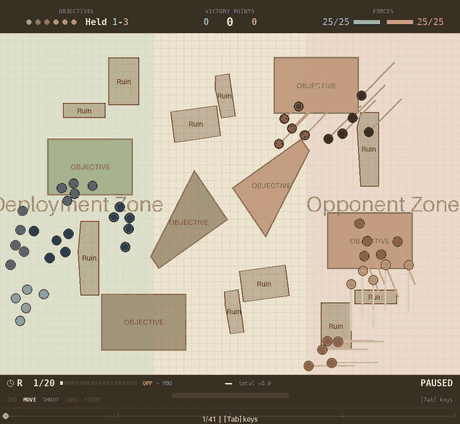
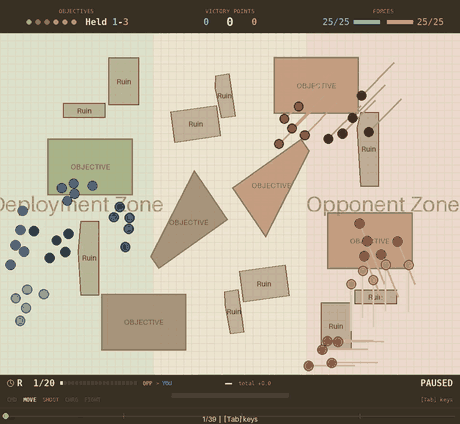

# The lead was rule-breaking

**2026-08-18** · PPO from scratch, 1000 epochs, two seeds ·
`configs/experiments/25v25_maps_take_opponent.yaml` · nine held-out tables, n=30,
seeds 700000+, identical layouts for every arm.

## The question

Two questions, run together.

1. **Was the scenario the ceiling?** A two-rule heuristic captured ~96% of the
   available value against `scripted_advance_and_shoot`, which picks its target
   uniformly and never revises where a squad is going. Is the game shallow, or
   is the *opponent* shallow?
2. **Can PPO beat the strongest scripted policy on tables it has never seen?**

## What was built

`scripted_baseline` (PR #203) plays any registered **baseline** on the opponent
side. The baselines are the strongest scripted play here but were written to
drive the *player*, and the two policy hierarchies are separate; the adapter
hands a baseline a side-swapped view of the env (`_MirroredEnv`) rather than
duplicating any policy.

**The opponent was most of the ceiling.** Same 60 layouts, seeds 700000+,
vp_margin with win rate in brackets:

| player | vs `scripted_advance_and_shoot` | coherent | vs `squad_march_take` | coherent |
|---|---|---|---|---|
| `random` | −23.1 (0.42) | 0.026 | −215.2 (0.00) | 0.168 |
| `greedy_nearest` | +3.2 (0.30) | 0.846 | −161.6 (0.00) | 0.897 |
| `split_evenly` | −24.6 (0.40) | 0.125 | −204.2 (0.00) | 0.202 |
| `squad_march` | +81.1 (0.93) | 0.843 | −168.8 (0.00) | 0.790 |
| **`squad_march_shoot`** (the old bar) | **+104.9 (0.98)** | 0.830 | **−5.6 (0.48)** | 0.795 |
| `contest_and_spread` | +102.3 (0.98) | 0.806 | −48.8 (0.20) | 0.729 |
| `squad_march_take` | +108.1 | — | +9.9 (mirror) | — |

Six of seven policies beat the old opponent; **none beats this one**. The bar
gives up 110 points of margin and lands on an even game. Headroom exists again.

## The result, and its retraction

Two seeds trained to 1000 epochs. Scored on the nine held-out tables.

### Referee off — the agent looks like it wins

| arm | vp_margin | win | held | alive | on_obj | coherent | adrift | firepower |
|---|---|---|---|---|---|---|---|---|
| agent s1 | −5.4 | 0.45 | 2.23 | 0.489 | 0.745 | 0.791 | 1.58 | 1.9 |
| **agent s2** | **+17.2** | 0.64 | 2.42 | 0.523 | 0.799 | 0.788 | 1.87 | 2.0 |
| `squad_march_shoot` | −12.4 | 0.43 | 2.58 | 0.443 | 0.975 | 0.774 | 1.32 | 1.1 |
| `squad_march_take` | +0.2 | 0.51 | 2.74 | 0.456 | 0.976 | 0.806 | 1.19 | 1.1 |

Paired per map: s2 beats the strongest script by **+17.0 ± 6.1** (t = 2.79,
ahead on 8/9). That would be the first time a learned policy beat the best
hand-written one here.

### ⚠ Referee on — it does not

`coherent` 0.79 means **roughly one unit-movement phase in five is a move the
rules forbid**. Re-scored with `enforce_move: revert_unit`, the spec's own mode:

| arm | referee off | referee on | the rule costs |
|---|---|---|---|
| agent s1 | −5.4 | −27.6 | **−22.3** |
| agent s2 | +17.2 | −14.1 | **−31.3** |
| `squad_march_shoot` | −12.4 | −31.4 | −19.1 |
| **`squad_march_take`** | +0.2 | **−4.1** | **−4.3** |

Paired, under legal play:

| | v the old bar | v the strongest script |
|---|---|---|
| agent s1 | +3.8 ± 9.6 (t=0.39, 5/9) | **−23.6 ± 7.5** (t=−3.14, ahead 2/9) |
| agent s2 | +17.4 ± 3.7 (t=4.65, **9/9**) | **−10.0 ± 2.6** (t=−3.83, ahead 1/9) |

**The +17.0 lead existed only while the agent was allowed to break the rules.**
Under the rule it loses by 10.0, behind on eight tables of nine. What survives:
both seeds still beat the old bar, and s2 does so on all nine tables.

## Why the tax is uneven

`squad_march_take` moves a whole unit along **one shared centroid vector**, so
relative positions are preserved by construction and it pays only 4.3. The agent
emits a per-model action distribution, so a single stray model cancels its whole
unit's move — 22 to 31 vp.

And the agent's *route to winning is the thing being taxed*. Unrefereed it plays
a different game rather than a better script: it stands on far less ground
(`on_obj` 0.75–0.80 against 0.98), holds slightly fewer objectives, and still
scores more — because it wins the firefight (`firepower` 1.9–2.0 against 1.1) and
keeps more of its army alive (0.49–0.52 against 0.44–0.46). Under a VP cap that
saturates at three objectives, killing the opponent's scoring models denies more
than standing on a fourth point.

That route depends on spreading out. The rule forbids spreading out. The
`adrift` column was the early warning: 1.6–1.9 models stranded per phase against
the script's 1.2, at a *similar* coherency rate.

## What this does not establish

- **Two seeds, differing by 22.6 vp unrefereed** — larger than s2's whole margin
  over the script. Neither the win nor the loss is a property of the method yet.
  Seeds 3 and 4 were launched and stopped at epochs ~297 and ~200; they answer
  nothing.
- **Training under the referee is not the fix.** Measured previously: it makes
  formation *worse* (0.569 against 0.756–0.886 for the reward gate alone),
  because every reverted action produces the identical outcome, so they share an
  advantage and the policy gradient inside that set is exactly zero.
- `table_05` splits the seeds hardest (s1 −33.8, s2 +32.0), the table task #121
  is already open about.

## Method notes

**Every score here carries coherency** (PR #205). `measure-baselines`,
`measure-checkpoint` and `measure-maps` now print `coherent` and `adrift`
unconditionally, because the rule is *measured* on every config and *enforced* on
almost none — a table without the column reads as compliance and is not. `random`
scores 0.008 coherent with 22.5 models adrift on the real tables.

The column is the **policy's own** figure: it reads `intended_coherency_rate` and
falls back to the realised rate only where nothing is enforcing and the two are
the same board. Under a referee the realised rate is 1.000 whatever the policy
does.

**Read the rate with `adrift` and `alive`.** `random`'s rate *rises* 0.026 →
0.168 against the stronger opponent while `alive` falls 0.849 → 0.105 — a unit
shot down to one model is coherent by definition, so the rate climbs as an army
dies.

**A competent opponent costs formation.** Every policy holds less against
`squad_march_take`: `squad_march` 0.843 → 0.790, the bar 0.830 → 0.795,
`contest_and_spread` 0.806 → 0.729. Do not carry a coherency figure across
opponents.

**Held-out set.** `configs/evaluation/maps/` contains all 45 tables and
`measure-maps` scores every map in the directory it is given — so scoring against
that directory mixes the 36 training tables with the 9 unseen ones. The numbers
here use a directory containing only the nine (`table_05` … `table_45`), verified
absent from the training pool.

## Two operational failures, both avoidable

- **Do not merge to `main` while runs are live.** `record_episode_callback`
  spawns a subprocess that **re-imports the code from disk** while the parent
  keeps what it imported at launch. Merging PR #202 mid-run gave the subprocess
  new code and an old pickled config → `AttributeError` on every recording epoch
  from then on. Training survived; the videos did not, and the run was executing
  code matching no commit on disk.
- **`nohup … &` does not survive a tool timeout**, which kills the process
  *group*; `nohup` only blocks SIGHUP. Launch with `setsid nohup … < /dev/null &`
  and verify in a separate command.

## Artefacts

- `configs/evaluation/25v25_maps_take_opponent_refereed.yaml` — the refereed play
  config, for recording and presentation, **never for training**
- `docs/images/take-refereed.gif` / `take-unrefereed.gif` — the same checkpoint on
  the same seeded table, with and without the referee

*Referee on: an incoherent move is cancelled for the whole unit, so every board
state is one the rules permit.*

*Referee off — how the agent actually plays. Roughly one unit-movement phase in
five is a move the rules forbid.*

## Next

1. **More seeds.** Four minimum before either direction is quotable.
2. **A per-model denial lever.** `vp_gain` *is* net (player − opponent), so denial
   is paid — but only by a **global** term, which is broadcast identically to
   every model and cannot create a preference between two things a model might
   do. Every per-model term ranks caution higher: `objective_hold` pays **1.0**
   for ground we control, **0.25** for ground they control, **0.0** for empty
   ground. Candidate: raise `opponent_value` / `contested_value`. Check income
   conservation first — an anti-caution lever must pay *more in total* than the
   behaviour it replaces, or it is a tax.
3. **Formation.** The agent's deficit under the rule is discipline, not scoring.
   `observe_unit_centroid` (PR #202) lifted a behaviour clone's coherency
   0.664 → 0.790 for −0.2 vp; whether it helps PPO is untested.
